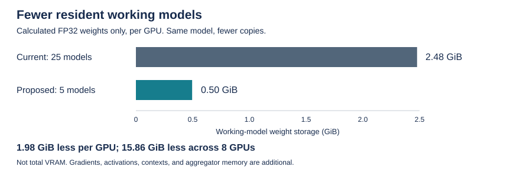
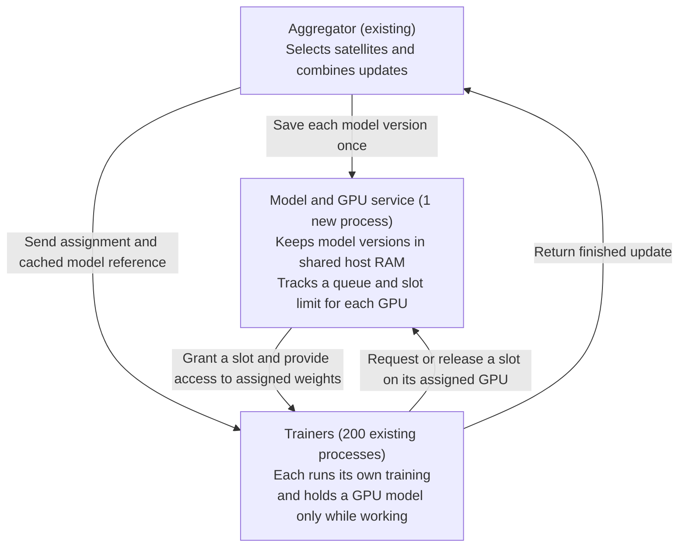

# FMoW model caching and GPU scheduling

Status: proposed implementation. No runtime changes are implemented by this document.

## 1. What changes and why

Keep one process per satellite. Add one service process per experiment that hosts both the shared model store and the GPU manager. The store retains starting weights; the manager tracks a separate queue and slot limit for each GPU.

A trainer keeps its dataset and satellite state, but only holds a GPU model while executing an assignment. The aggregator still selects satellites and combines their updates. The GPU manager does not choose experiment participants or execute training itself.

For the [200-trainer example](../lib/python/examples/fmow/exports/fmow_fedavg_n200.yaml):

| Setting | Meaning | Change |
|---|---|---|
| 200 trainers | Number of satellite processes | None |
| Selector `c: 200` | Target outstanding selections | None |
| Aggregation goal 175 | Responses targeted for aggregation | None |
| 8 GPUs | Trainer placement pool | None |
| Five active trainers per GPU | New hardware execution limit | Add a queue and slot ownership per GPU |

The existing selector `k: 5` is unused. It does not provide the new limit. Five GPU slots is an example to test, not a guaranteed safe or optimal setting.

Today, all 200 trainers create a GPU model during initialization. With eight GPUs, that is 25 trainer models per GPU, including idle trainers.

FMoW's FP32 model has 26,608,958 parameters: **101.5 MiB of weights per complete model**. Five resident copies instead of 25 reduces working-model weight storage from **2.48 GiB to 0.50 GiB per GPU**, a saving of **1.98 GiB**.

These are calculated tensor sizes, not measured total VRAM. Gradients, activations, allocator reservations, received-weight copies, and aggregator allocations are additional. Sources: [FMoW model definition](../lib/python/examples/fmow/dependencies/model.py) and [Torchvision DenseNet implementation](https://docs.pytorch.org/vision/stable/_modules/torchvision/models/densenet.html). The aggregator needs its own memory allowance, especially when it shares a trainer GPU.

Caching also avoids retaining one complete starting-weight copy per waiting trainer. If 200 assignments reference version 12, the store holds version 12 once.

**Frozen-weight sharing is optional, not part of the initial implementation.** A complete snapshot is sufficient. Separating the 64.8 MiB frozen portion from the 36.7 MiB changing portion could later save 64.8 MiB for each additional retained version.

## 2. Architecture and assignment flow

The new service has two jobs: keep starting weights in shared host RAM and
control how many trainers use each GPU at once. The aggregator still selects
satellites and combines updates. Each trainer still owns its dataset and runs
its own training.

This adds one process: **1 aggregator + 200 trainers + 1 service = 202
processes**. The service maintains a separate queue for each GPU. With eight
GPUs and five slots per GPU, up to 40 trainers can work concurrently. A slot
is permission to load and use a GPU model; the trainer holds it until cleanup
is complete.

### How an assignment runs

An assignment tells a trainer which model version to use and what work to do.
A **cached model reference** identifies the starting weights saved in the store.
It includes an ID unique within the experiment, the trainer ID, model version,
operation, and existing dispatch metadata. That same assignment ID identifies
the trainer's cached model reference, GPU slot, and returned result.

1. **The aggregator saves the starting weights.** It publishes one snapshot
   of the version and records which assignments need it before dispatching them.
   Trainers receive the cached model reference rather than a full copy of the weights.
2. **The trainer waits for a GPU slot.** It records the selected data and
   assignment settings, then requests a slot on its existing assigned GPU.
   It holds no GPU model while queued.
3. **The trainer loads and trains its own model.** Once admitted, it constructs
   a private GPU model, copies in the assigned weights, and runs its existing
   training loop. Publishing a newer version does not change those starting weights.
4. **The trainer prepares its result and frees the GPU.** It computes the update
   against the starting version and copies results and metrics into independent
   CPU storage. After GPU work and cleanup finish, it releases the slot and
   its reference to the starting weights.
5. **The trainer uploads when allowed.** Remaining modeled delays and contact
   waits use the prepared CPU result, so they do not keep a GPU model resident.
   Upload uses the existing transport.

Evaluation follows the same sequence. Assignments with no data can finish
without requesting a GPU slot.

### How weights and slots are kept alive

A snapshot is a saved copy of one model version. It lives in shared host RAM,
which multiple processes can read. Training always uses a private GPU copy;
it never changes the shared snapshot or the aggregator's current weights.
Read requests return a shared-memory handle and tensor metadata, avoiding
serialized weight copies for every waiting trainer.
[PyTorch sharing support](https://docs.pytorch.org/docs/2.14/multiprocessing.html)

The store keeps the latest version and any older version still needed by an
assignment. For example, publishing version 13 does not remove version 12
while a queued trainer still needs it. A trainer releases its reference after
preparing its update, because delta calculation still needs the starting weights.
Keep one outstanding assignment/result per trainer and make repeated releases
harmless. Report stored versions and bytes; there is no configurable byte limit.
Stalled assignments can retain memory, and allocation failure must stop the run
rather than evict weights still in use.

A slot is released only after cleanup or confirmed trainer exit. A timeout or
discarded result does not establish that the trainer has stopped using the GPU.
Cleanup must remove the model, optimizer, gradients, temporary tensors, metric
tensors, and views, then release unused allocator blocks. Calling `empty_cache()`
while live tensors remain is insufficient.
[PyTorch memory management](https://docs.pytorch.org/docs/2.14/notes/cuda.html#memory-management)

### Files to add

These are components of the same service and its clients, not separate processes.

| Proposed file | Responsibility |
| --- | --- |
| `lib/python/flame/gpu/model_store.py` | Publish complete snapshots, retain them for assignments, return shared-memory handles, and release references. |
| `lib/python/flame/gpu/manager.py` | Track FIFO queues and active slots per GPU; issue assignment-specific tokens; handle cancellation, confirmed exits, and status requests. |
| `lib/python/flame/gpu/service.py` | Run the store and manager in one process. A queued request must not block requests for other GPUs. |
| `lib/python/flame/gpu/client.py` | Connect the aggregator and trainers to the service through local IPC. Keep CUDA tensors out of control messages. |
| `lib/python/examples/fmow/dependencies/gpu_session.py` | Load the trainer's private model, prepare CPU results, and clean up on success or failure. Runs inside the existing trainer. |

All trainers use the same service endpoint and include their assigned GPU in
slot requests. Preserve the launcher's round-robin placement and GPU visibility
mapping. The service handles shared CPU storage and slot permissions; each
trainer performs its own GPU allocation, weight copy, and training. The generic
store and manager do not need to know about satellite captures, datasets, or FedAvg.

## 3. Implementation plan

Start with FMoW FedAvg on one host, enabled through an optional setting. Keep
it disabled by default. Use small overridable methods, or hooks, in the shared
aggregator and trainer code so other examples retain their existing behavior.

### Step 1: start the service from the launcher

Add **model_store.py**, **manager.py**, **service.py**, and **client.py** as
described above. Test the store and manager independently of training, with
unit tests under **lib/python/tests/gpu/**.

Wire the service into the existing launcher:

- [experiment_config.py](../lib/python/flame/launch/experiment_config.py): parse
  the optional setting and require a positive slot count.
- [runner.py](../lib/python/flame/launch/runner.py): start the service before
  assignments can be sent, wait for readiness, supervise its process, and pass
  the connection endpoint to the aggregator and trainers.
- [spawner.py](../lib/python/flame/launch/spawner.py): include the endpoint and
  each trainer's assigned GPU in its generated configuration.
- [snapshot.py](../lib/python/flame/launch/snapshot.py) and
  [execution_config_generator.py](../lib/python/flame/launch/execution_config_generator.py):
  record the effective slot count, service mode, and GPU mapping.

Proposed configuration:

~~~yaml
execution:
  num_gpus: 8
  gpu_admission:
    enabled: true
    max_active_trainers_per_gpu: 5
~~~

Host shared memory is the initial storage implementation; no cache-placement
setting is needed. The launcher also owns shutdown: stop new grants, drain or
stop trainers, confirm their exits, then release shared storage and stop the
service. If the service fails, stop the experiment. Automatic restart and
replay are outside the initial scope.

**Check:** mock clients obey each GPU's limit, a busy GPU does not block another,
and queued cancellation, duplicate release, version retention, and trainer-exit
cleanup work before training is connected.

### Step 2: send cached model references to trainers

Update **_distribute_weights** in the
[shared sync aggregator](../lib/python/flame/mode/horizontal/syncfl/top_aggregator.py)
and connect the new behavior in the
[FMoW aggregator](../lib/python/examples/fmow/aggregator/pytorch/main_fedavg_agg.py).

Add a hook for dispatching cached models. It prepares the message sent to each
selected trainer. When caching is disabled, continue sending full weights.
When caching is enabled:

1. Save the starting weights once in the shared store, for example as version 12.
2. Record that each assignment needs version 12. This keeps those weights
   available while its trainer waits for a GPU or prepares its update.
3. Send each trainer the cached model reference and an assignment ID. The cached
   model reference tells it which stored weights to load; the assignment ID identifies
   that trainer's particular piece of work.

Keep the same selected trainers and the message's existing round/version,
train-or-evaluate operation, simulation send time, and data-sampling information.

Add the cached model reference and assignment-ID fields to
[message.py](../lib/python/flame/mode/message.py). Results must include the
assignment ID and model version. Continue supporting full-weight messages
when the feature is disabled.

In **_fetch_weights** in the
[shared trainer](../lib/python/flame/mode/horizontal/syncfl/trainer.py), add a
hook for receiving cached model references. It records the metadata without
calling `weights_to_model_device` or loading a model. Preserve receive and
version checks and channel bookkeeping.

Publish successfully before sending any references. If dispatch times out,
keep the version retained until cancellation is acknowledged or the trainer
has stopped; it may still receive the assignment and read the weights.

**Check:** waiting trainers reference one shared snapshot without private
full-weight copies, and older assignments remain usable after a newer version
is published.

### Step 3: load GPU models only after a slot is granted

Use **gpu_session.py** in the
[FMoW trainer](../lib/python/examples/fmow/trainer/pytorch/main.py) to manage
work from slot acquisition through GPU cleanup.

- **At initialization:** keep dataset setup, satellite state, communication,
  and parameter-name metadata, but defer GPU model creation. Adjust initialization
  and profiling calls that currently assume the model already exists.
- **Before training or evaluation:** record the assignment's selected data and
  settings before queueing. After the grant, construct the model, load its
  assigned weights, and create the optimizer.
- **During training:** retain the current epochs, batches, and fresh SGD optimizer
  per training assignment. Preserve the trainer's RNG state around model
  construction so reconstruction does not alter shuffling or other randomness.
- **After computation:** prepare the result and clean up on both success and
  failure. Release the slot before the modeled sleep at the end of today's
  `train()` method.

Extend [model.py](../lib/python/examples/fmow/dependencies/model.py) with an
architecture-only construction option. The aggregator initializes the starting
weights; trainers load the published snapshot without downloading pretrained
weights for every assignment or training from random initialization. Preserve
the builder's existing default when the feature is disabled.

**Check:** multiple trainers can use a slot in succession without changing
shared weights or each other's updates. Training, evaluation, no-data work,
and errors all release their resources correctly.

### Step 4: prepare CPU results before releasing the model

Today, **_send_weights** in the
[shared trainer](../lib/python/flame/mode/horizontal/syncfl/trainer.py) waits
for availability and then reads the model to calculate the update. Prepare
that update earlier so waiting for contact does not occupy a GPU slot.

Add a proposed **prepare-result hook** that runs while the trainer still owns
its GPU model:

1. Calculate the delta against the assigned starting version and finish
   model-dependent metrics. Preserve frozen-parameter filtering and existing
   privacy/regularizer behavior.
2. Copy the required result tensors to independent CPU storage. Keep frozen
   and trainable parameter names separately so upload can use them after the
   model is gone.
3. Synchronize outstanding GPU work, remove GPU references, release unused
   allocator storage, and release the slot. Release the cached model reference once
   delta calculation no longer needs it.

Then let **_send_weights** add send-time metadata and perform availability
checks, serialization, and upload using the prepared CPU result. Delayed or
retried uploads must not rerun training or create another GPU model.

Hold at most one outstanding assignment/result per trainer. Drop local result
storage after transport acceptance or an intentional discard under the existing
policy. Default hooks preserve current behavior when the feature is disabled;
transport logic stays in the trainer.

**Check:** a trainer waiting to upload holds neither a GPU model nor a slot,
and fixed inputs produce the same update and required metrics as the existing path.

### Step 5: distinguish GPU queueing from satellite delays

The selector and receive barrier must recognize a healthy trainer waiting for
a slot. Expose each assignment's queued, granted, and released status to the
aggregator, then update the
[random selector timeout](../lib/python/flame/selector/random.py) and
[sync receive barrier](../lib/python/flame/mode/horizontal/syncfl/top_aggregator.py)
so queueing alone does not trigger failure or redispatch.

Keep host execution time and simulated satellite time separate:

- Record queue wait separately from actual compute time. Queue wait must not
  enter the simulated training delay or make additional captured images eligible.
- Preserve the current `max(actual compute, configured delay)` formula.
  Concurrency can change measured compute time, so simulated trajectories may
  still differ.
- Preserve pending assignments and modeled update ordering. GPU queue order
  must not alone decide which updates count toward aggregation.

Use a bounded host watchdog for genuine stalls. A timeout or discarded result
cannot free an active slot; require cleanup acknowledgement or confirmed
trainer exit. After aggregation reaches 175 responses, the remaining assignments
still need to finish or be cancelled and cleaned up.

**Check:** healthy queued trainers are not redispatched or falsely failed,
and late or repeated messages cannot release another assignment's resources.

### Step 6: verify the integration and choose the slot limit

Add FMoW integration tests and a standalone memory/throughput probe under its
scripts directory. Use the actual model with synthetic 224 × 224 images and
batch size 16 for initial memory checks.

Start with 2 trainers / 1 GPU / 1 slot, then 10 trainers / 2 GPUs, then the
200-trainer configuration. Compare against the existing path using fixed
assignments, starting versions, input indices, and seeds, with an explicit
numerical tolerance for updates.

Verify that:

- Slot limits hold from model loading through cleanup, and all GPUs receive
  work under the existing placement mapping.
- Peak memory falls and training tensor memory returns to the idle baseline
  after release. Record both allocated and reserved memory.
- Referenced versions survive until release; older versions disappear after
  their last reference, and waiting trainers do not retain private snapshots.
- Evaluation, no-data work, cancellation, trainer or service failure, contact
  waits, and shutdown leave no stranded slots.
- The disabled path and other examples still work.

Report model-copy time, queue wait, compute time, retained-version bytes,
peak GPU memory, and end-to-end throughput. Include aggregator memory when
choosing the slot limit instead of assuming five is safe.

**Check:** the full FMoW run completes, the memory reduction is measured, and
any differences in timing or output are explained.

### Future work

**Share frozen weights across cached versions.** The frozen layers keep the
same weights throughout training. Store that portion once and keep only the
changing weights for each version. For this model, that could save 64.8 MiB
for each additional cached version. Trainers would still load a complete
private model from the shared frozen weights and their assigned version's
changing weights.

**Cache starting weights on the GPUs.** Keep model snapshots in GPU memory
so trainers can load them without repeatedly copying the weights from host RAM.
Define how trainers access the cached snapshots while keeping their training
models private and writable. Compare loading time and throughput against the
host-memory store, including the VRAM used by cached versions and the service's
own CUDA contexts.

**Move training into a fixed pool of GPU worker processes.** Keep satellite
state, datasets, and communication in the existing trainers, but have them send
training requests to reusable workers. Only the workers initialize CUDA; each
worker loads the requested version, trains, and returns a CPU result. With five
workers per GPU, this reduces the number of persistent training CUDA contexts
from 25 to five per GPU. The workers still have their own contexts, but idle
satellite trainers no longer retain one each.

This addresses memory that model cleanup alone does not free: a long-lived
trainer can retain CUDA context and library overhead after deleting its model.
Measure that remaining memory before choosing the worker count. Preserve each
satellite's data selection, RNG state, model version, and simulated timing when
delegating computation.
