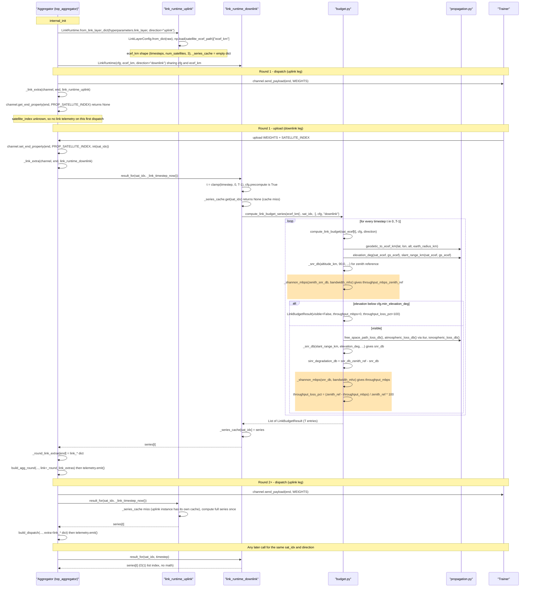
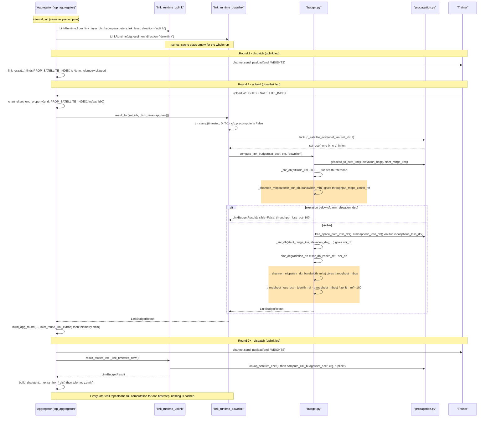

# Flame Link Layer: Ground-Station ↔ Satellite RF Budget

A configurable, physics-based RF link budget between the **aggregator (ground station)** and each connected **trainer (satellite)** — path loss + atmospheric loss + ionospheric loss → SINR degradation → throughput loss. Lives entirely in `flame/link/`, disabled by default, opt in via `hyperparameters.linkLayer.enabled` in a job config. Every number the formulas use — RF parameters *and* physical constants/model coefficients — is a config field; nothing is hardcoded in the calculation modules.

**Status: wired into the aggregator only.** `flame/link/` (including the mode-agnostic `LinkRuntime` in `flame/link/runtime.py`) is a standalone module with no dependency on which role calls it — an aggregator currently does, computing a link budget per connected trainer from the shared satellite position file. Trainer-side integration (a trainer computing its own link budget) is not wired up right now; it's a clean follow-up against the same `LinkRuntime` API whenever that's needed.

This is a layer on top of Flame's base FL runtime (role composition, the aggregator/trainer call flow, weight-update math, per-round configuration). Cross-checked against `lib/python/examples/async_cifar10` and `lib/python/examples/fmow`, both of which wire this module into their aggregators.

## Contents

1. [Call flow: when the link budget gets computed is itself configurable](#1-call-flow-when-the-link-budget-gets-computed-is-itself-configurable)
2. [How the three losses are calculated](#2-how-the-three-losses-are-calculated)
3. [How bandwidth and throughput are calculated](#3-how-bandwidth-and-throughput-are-calculated)
4. [Full configurable parameter reference](#4-full-configurable-parameter-reference)

---

## 1. Call flow: when the link budget gets computed is itself configurable

An aggregator is the ground station for potentially many trainers at once, so it needs a link budget per connected trainer, not one fixed satellite — and it needs both directions: dispatching the model out is the ground→satellite (**uplink**) leg, receiving a trainer's update is the satellite→ground (**downlink**) leg. Both go through the exact same `LinkRuntime.result_for(satellite_index, timestep)` call, just with two instances (`self.link_runtime_uplink`, `self.link_runtime_downlink`) built from the same config and satellite position file, differing only by `direction`.

A satellite's full trajectory is already known the instant its position file is loaded — `ecef.npz` holds every timestep for the entire simulation window up front, not just "now." `linkLayer.computeMode` picks what to do with that fact:

| `computeMode` | When the math runs | Use when |
|---|---|---|
| `precompute` (default) | The first time a given `satellite_index` is asked for — its whole trajectory's loss/SNR/throughput computed in one pass, cached inside `LinkRuntime`, then indexed by timestep on every later call (O(1), no recomputation) | The satellite's whole trajectory is already known up front — true for every example in this repo. Lazy per-satellite caching (not eager at process start) means the aggregator only pays for satellites that actually connect |
| `per_round` | Every call, from scratch, on that one position | A future position source that streams positions live instead of loading a static file ahead of time |

`satellite_index` for a given connected trainer (`end`) is unknown until that end's first uplink message arrives — `end_id` (the channel/MQTT identity) doesn't encode it, since trainer registry task IDs are unrelated to `trainer_id` ordering, so it has to ride an actual message field: `MessageType.SATELLITE_INDEX`, stamped by any trainer that has a `self.satellite_index` (`flame/mode/horizontal/syncfl/trainer.py`'s `_send_weights` — both example trainers set `self.satellite_index` for other reasons already, e.g. dataset splits, so this stamp fires regardless of whether a trainer does anything with the link-layer module itself). The aggregator caches it into `channel.set_end_property(end, PROP_SATELLITE_INDEX, ...)` the first time it arrives. Until then, that end's link telemetry is simply omitted (same best-effort spirit as every other opt-in field here) — expected for the first message from a fresh end.

Both diagrams show the same aggregator round; only what happens inside `LinkRuntime.result_for` differs. Setup (`internal_init`) is identical in both modes. **Orange shaded blocks mark where throughput is calculated** (`_shannon_mbps` and `throughput_loss_pct`).

### 1a. `computeMode: precompute` (default)



### 1b. `computeMode: per_round`



Cost trade-off: `precompute` pays T timesteps of `compute_link_budget` once per (satellite, direction), then every call is a list index. `per_round` pays one `compute_link_budget` per call, which only makes sense for a position source that can't be loaded up front. Both directions use the same formulas and differ only in `frequency.uplink_ghz` vs `frequency.downlink_ghz`.

Either mode consumes its `LinkBudgetResult` the same way: folded into telemetry only (`build_dispatch`'s and `build_agg_round`'s `extra` fields). This is telemetry-only by design — nothing here touches dispatch timing, the virtual-clock gate, or aggregation itself (`affectsDelay`, the trainer-side opt-in for folding link-implied transmit time into round timing, has no aggregator-side equivalent yet since there's no aggregator-side round timing it would plug into).

Citations: `flame/link/runtime.py` (`LinkRuntime`), `flame/mode/horizontal/syncfl/top_aggregator.py`'s `internal_init` (builds both `LinkRuntime`s), `_link_timestep_now`/`_link_extra` (shared helpers), `_aggregate_weights` (caches `PROP_SATELLITE_INDEX`, folds `link_*` into `build_agg_round`'s `extra`), `_distribute_weights` (folds `link_*` into `build_dispatch`'s `extra`). `flame/mode/horizontal/asyncfl/top_aggregator.py` reuses all of the above via inheritance and adds the same wiring at its own per-end message-processing and dispatch sites (both `train` and `eval` branches). `flame/mode/horizontal/syncfl/trainer.py`'s `_send_weights` stamps `MessageType.SATELLITE_INDEX`.

## 2. How the three losses are calculated

All three are pure functions of `(elevation, range, frequency)` plus a handful of config fields — no simulation state, so they're independently unit-testable.

**Free-space path loss** (`flame/link/propagation.py`) — the Friis transmission equation, [Friis, "A Note on a Simple Transmission Formula," Proc. IRE, 1946](https://ieeexplore.ieee.org/document/1697062/), standardized as [ITU-R P.525-5, "Calculation of free-space attenuation"](https://www.itu.int/dms_pubrec/itu-r/rec/p/R-REC-P.525-5-202411-I!!PDF-E.pdf):

```
FSPL(dB) = 20·log10(range_km) + 20·log10(freq_GHz) + fspl_constant_db
```

`fspl_constant_db` (default **92.45**) is `20·log10(4π·10⁹·10³ / c)` for range in km and frequency in GHz, `c` = speed of light — not an arbitrary number, but still a config field (`linkLayer.pathloss.fsplConstantDb`) since some references round it slightly differently (92.44/92.45) or use a different `c`.

**Atmospheric (tropospheric gas) loss** (`flame/link/propagation.py`) — real ITU-R P.676 gaseous attenuation, computed directly by [ITU-Rpy](https://itu-rpy.readthedocs.io/en/latest/) (`itur.models.itu676.gaseous_attenuation_slant_path`), an open-source Python implementation of the ITU-R P-series recommendations. ITU-Rpy is a **core dependency of this package** (`lib/python/setup.py`'s `install_requires`), not optional. No configured zenith figure to scale — it takes frequency, elevation, water vapor density, pressure and temperature directly and returns the already-elevation-scaled slant-path loss:

```python
attenuation = itur.models.itu676.gaseous_attenuation_slant_path(
    freq_ghz, elevation_deg, water_vapor_density_g_m3, pressure_hpa, temperature_k, mode="approx"
)
```

`waterVaporDensityGM3` / `pressureHpa` / `temperatureK` (US Standard Atmosphere sea-level defaults: 7.5 g/m³, 1013.25 hPa, 288.15 K) are tunable per ground-station climate. `min_elevation_for_airmass_deg` (default 5°) clamps elevation before calling ITU-Rpy, since its "approx" method is only valid for elevation in [5, 90] deg. `atmospheric_loss_db` suppresses ITU-Rpy's own boundary-elevation `RuntimeWarning` internally, since it otherwise fires on essentially every call — the module's own clamp sits right at ITU-Rpy's valid-range edge.

**Ionospheric loss** (`flame/link/propagation.py`) — a fixed, directly-configured margin, not a formula:

```
A_iono(dB) = ionospheric.lossDb
```

No TEC/frequency model — ionospheric effects are dominant at L/S-band and small enough at Ku/Ka that a configured constant (default **0.005 dB**, representative of a Ku-band figure) is simpler and no less accurate than a from-scratch model would be at this frequency range. `ionospheric_loss_db()` is kept as a function (rather than reading `cfg.ionospheric.loss_db` inline) purely so a real dynamic model can be swapped in behind the same signature later, matching the pattern used by `atmospheric_loss_db`. See [ITU-R P.531, "Ionospheric propagation data and prediction methods"](https://www.itu.int/dms_pubrec/itu-r/rec/p/R-REC-P.531-16-202509-I!!PDF-E.pdf) for the standard covering ionospheric effects, if that upgrade is ever made.

## 3. How bandwidth and throughput are calculated

**Link budget equation** (`flame/link/budget.py:_snr_db`) — standard satellite-link form used throughout [CCSDS 401.0-B, "Radio Frequency and Modulation Systems — Part 1"](https://ccsds.org/Pubs/401x0b32.pdf) and [ITU-R P.618](https://www.itu.int/dms_pubrec/itu-r/rec/p/R-REC-P.618-14-202308-I!!PDF-E.pdf). Variable names below match `_snr_db`'s actual local variables, not generic symbols — `received_power_dbw` is the code's name for the classic `Pr = EIRP + Gr − losses` term:

```
received_power_dbw = satellite.eirpDbw + groundStation.antennaGainDbi − total_path_loss_db
total_path_loss_db = free_space_path_loss_db + atmospheric_loss_db + ionospheric_loss_db
                    + losses.implementationLossDb + losses.rainMarginDb
```

**Thermal noise floor** — Johnson–Nyquist noise power in the receiver's bandwidth, [Nyquist, Phys. Rev. 32, 110 (1928)](https://link.aps.org/doi/10.1103/PhysRev.32.110) and [Johnson, Phys. Rev. 32, 97 (1928)](https://link.aps.org/doi/10.1103/PhysRev.32.97):

```
thermal_noise_floor_dbw = 10·log10(physical.boltzmannJPerK · groundStation.systemNoiseTempK · bandwidth_hz)
snr_db                  = received_power_dbw − thermal_noise_floor_dbw
```

`physical.boltzmannJPerK` (default the CODATA exact value `1.380649×10⁻²³` J/K, [NIST CODATA](https://physics.nist.gov/cgi-bin/cuu/Value?k)) is a physical constant, but — per the instruction that *nothing* stays hardcoded in the calculation modules — it's a config field too, so e.g. a non-SI unit convention or a deliberately-stress-tested value can be substituted without editing code.

**SINR degradation** (`flame/link/budget.py:compute_link_budget`) — every result also computes a second SNR at the *zenith reference* (same satellite altitude, straight overhead, elevation = 90°, airmass = 1 — the best-case pass for that satellite/ground-station pair), by calling `_snr_db` a second time with `elevation_deg=90`:

```
sinr_degradation_db = zenith_reference_snr_db − snr_db
```

This directly answers "how much has path loss + atmospheric loss + ionospheric loss degraded the link, right now, versus the best this pass could ever be" — elevation-dependent, so it's near 0 dB overhead and grows as a satellite approaches the visibility horizon.

**Throughput and throughput loss** (`flame/link/budget.py:_shannon_mbps`) — Shannon–Hartley channel capacity, [Shannon, "A Mathematical Theory of Communication," Bell System Technical Journal, 1948](https://doi.org/10.1002/j.1538-7305.1948.tb01338.x), computed for both the actual and zenith-reference SNR:

```
throughput_mbps      = bandwidth_hz · log2(1 + 10^(snr_db / 10)) / 1e6
throughput_loss_pct  = max(0, (zenith_reference_throughput_mbps − throughput_mbps) / zenith_reference_throughput_mbps · 100)
```

Shannon capacity is an *upper bound* no real modem achieves — treat these as a relative degradation signal (X% lost between two elevations/configs), not literal achievable megabits.

#### Worked example: satellite 289's pass over Svalbard

One full round trip through the pipeline, real data, default config (Svalbard ground station, `itur_p676` atmospheric model), satellite 289 in `_metadata/leo/ecef.npz`, timestep 3214 (near the peak of a real pass):

| Step | Computation | Result |
|---|---|---|
| **1. Coordinates** | `geodetic_to_ecef_km(78.9243, 11.9231, 0)` → ground station; `ecef_km[3214, 289, :]` → satellite (no conversion needed, already ECEF) | `ground_station_ecef_km = [1197.50, 252.86, 6252.34]` km<br/>`sat_ecef_km = [1172.20, 332.41, 6753.75]` km |
| **2. Elevation** | `compute_elevation_deg(sat_ecef_km, ground_station_ecef_km)` — dot product of the line-of-sight vector with the ground station's zenith direction | `elevation_deg = 74.7754°` |
| **3. Slant range** | `compute_slant_range_km(sat_ecef_km, ground_station_ecef_km)` — Euclidean distance | `slant_range_km = 508.3128` km |
| **4. Path loss** | `free_space_path_loss_db` (Friis) + `atmospheric_loss_db` (ITU-R P.676) + `ionospheric_loss_db` (fixed) | `167.9363 + 0.0595 + 0.0050 = 168.0008 dB` (+1.0 dB implementation loss → `total_path_loss_db = 169.0008 dB`) |
| **5. SNR** | `received_power_dbw = 38.2 + 35.8 − 169.0008`; `thermal_noise_floor_dbw = 10·log10(1.380649e-23 × 200K × 240MHz)` | `received_power_dbw = -95.0008 dBW`<br/>`thermal_noise_floor_dbw = -121.7867 dBW`<br/>`snr_db = 26.7859 dB` |
| **6. SINR degradation** | Same chain again at `elevation_deg = 90°` (zenith reference) → `zenith_reference_snr_db = 27.0754 dB` | `sinr_degradation_db = 27.0754 − 26.7859 = 0.2894 dB` |
| **7. Throughput** | `throughput_mbps = 240MHz · log2(1 + 10^(26.7859/10))` vs. `zenith_reference_throughput_mbps` at 27.0754 dB | `2136.27 Mbps` vs. `2159.30 Mbps` → **`throughput_loss_pct = 1.07%`** |

Near-overhead (74.8°), the link is barely degraded — only 1.07% throughput lost relative to the best this satellite/ground-station pair could ever achieve. Contrast with the same pass at its lowest visible elevation, timestep 8726 (25.09°, right at the `minElevationDeg` mask): `slant_range_km` grows to `1015.1`, `total_loss_db` to `175.08`, `snr_db` drops to `20.70`, and `throughput_loss_pct` jumps to **23.40%** — the same seven-step chain, just evaluated at worse geometry, showing exactly why elevation is the dominant variable in this whole pipeline.

## 4. Full configurable parameter reference

Every field below is a `LinkLayerConfig` field (`flame/link/config.py`) and every one is reachable via `hyperparameters.linkLayer.<camelCase path>` in a job config — none of it is compiled into the calculation modules as a bare literal. Currently only the aggregator's own `hyperparameters.linkLayer` is read (see Status, above); the same field set applies unchanged whenever trainer-side integration is added back.

| Field (dot path) | Default | Meaning | Derivation / standard |
|---|---|---|---|
| `enabled` | `false` | Turn the whole module on | — |
| `affectsDelay` | `false` | Reserved: fold link-implied transmit time into round timing (else telemetry-only). Not currently read by the aggregator (no aggregator-side round timing to fold it into) — meaningful again once a trainer-side consumer exists | — |
| `computeMode` | `precompute` | `precompute`: whole trajectory computed once at load time, indexed per round. `per_round`: recomputed from scratch every round. Any other value falls back to `precompute` | See §1 |
| `minElevationDeg` | `25.0°` | Below this, satellite is not visible (`visible=false`, 100% throughput loss) | Typical LEO satellite elevation mask, approximate |
| `minReferenceRangeKm` | `1.0 km` | Numerical floor under the zenith-reference range (avoids div-by-~0) | Numerical guard, not physical |
| `satelliteEcefPath` | `examples/_metadata/leo/ecef.npz` | Shared LEO position dataset (needs altitude — `geodetic.npz` alone lacks it) | — |
| `geometry.earthRadiusKm` | `6371.0 km` | Spherical-Earth radius for geodetic→ECEF | [NIMA TR8350.2, WGS84 definition](https://gis-lab.info/docs/nima-tr8350.2-wgs84fin.pdf) (IUGG mean 6371.0088, rounded); matches `examples/fmow/setup/captures.py` |
| `physical.boltzmannJPerK` | `1.380649×10⁻²³ J/K` | Boltzmann constant, for the thermal noise floor | [NIST CODATA exact value](https://physics.nist.gov/cgi-bin/cuu/Value?k) |
| `pathloss.fsplConstantDb` | `92.45 dB` | FSPL constant term (see §2) | [Friis (1946)](https://ieeexplore.ieee.org/document/1697062/) / [ITU-R P.525-5](https://www.itu.int/dms_pubrec/itu-r/rec/p/R-REC-P.525-5-202411-I!!PDF-E.pdf), derived from `c` |
| `groundStation.latDeg/lonDeg/altM` | Svalbard Satellite Station, Norway (78.9243, 11.9231, 0) | Ground-station position | Empirically near-optimal for this near-polar constellation — override with your own site |
| `groundStation.antennaGainDbi` | `35.8 dBi` | Rx antenna gain (boresight) | FCC STA application 1423-EX-ST-2024 |
| `groundStation.systemNoiseTempK` | `200 K` | Receiver system noise temperature | Representative Ku-band VSAT receiver (textbook) |
| `satellite.eirpDbw` | `38.2 dBW` | Satellite max EIRP | FCC STA application 1423-EX-ST-2024 |
| `satellite.antennaGainDbi` | `32.2 dBi` | Satellite Tx antenna gain (max-slant) | Same FCC filing |
| `frequency.downlinkGhz` | `11.7 GHz` | Downlink carrier (mid of FCC-filed 10.7–12.7 GHz band) | [FCC STA 1423-EX-ST-2024](https://apps.fcc.gov/els/GetAtt.html?id=355143) |
| `frequency.uplinkGhz` | `14.25 GHz` | Uplink carrier (mid of FCC-filed 14.0–14.5 GHz band) | Same filing |
| `frequency.bandwidthMhz` | `240 MHz` | Channel bandwidth | [Ku-band downlink channelization measurements, arXiv:2210.11578](https://arxiv.org/pdf/2210.11578) — 8×240 MHz channels, 10 MHz guard bands |
| `losses.implementationLossDb` | `1.0 dB` | Fixed hardware/implementation margin | Representative |
| `losses.rainMarginDb` | `0.0 dB` | Optional additive rain margin | Off by default |
| `atmospheric.waterVaporDensityGM3` | `7.5 g/m³` | Water vapor density | US Standard Atmosphere, mid-latitude representative |
| `atmospheric.pressureHpa` | `1013.25 hPa` | Atmospheric pressure | US Standard Atmosphere, sea level |
| `atmospheric.temperatureK` | `288.15 K` | Absolute temperature | US Standard Atmosphere, sea level (15°C) |
| `atmospheric.minElevationForAirmassDeg` | `5.0°` | Elevation floor before calling ITU-Rpy | ITU-Rpy's "approx" method is only valid for elevation in [5, 90] deg |
| `ionospheric.lossDb` | `0.005 dB` | Fixed ionospheric loss margin — no TEC/frequency formula, set directly | Representative Ku-band figure; see [ITU-R P.531](https://www.itu.int/dms_pubrec/itu-r/rec/p/R-REC-P.531-16-202509-I!!PDF-E.pdf) if a dynamic model is ever needed |

FCC filing sources in full: [STA application 1423-EX-ST-2024](https://apps.fcc.gov/els/GetAtt.html?id=355143), [FCC DA-24-222](https://docs.fcc.gov/public/attachments/DA-24-222A1.pdf).

> **Not configurable, on purpose:** the `90°` zenith-reference elevation (it *is* the definition of "directly overhead" — changing it would redefine what "the reference pass" means, not tune the model) and unit-conversion factors (MHz→Hz, Hz→Mbps — dimensional bookkeeping, not modeling choices).

---

*Built from a read-only trace of `lib/python/flame/link/` — cross-checked against `examples/async_cifar10` and `examples/fmow`. File:line citations are inline throughout; re-run the same trace if the referenced lines have since moved.*
