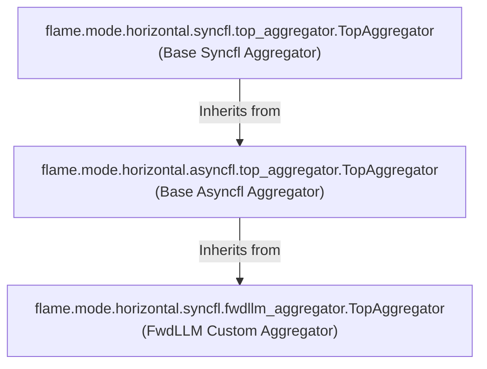
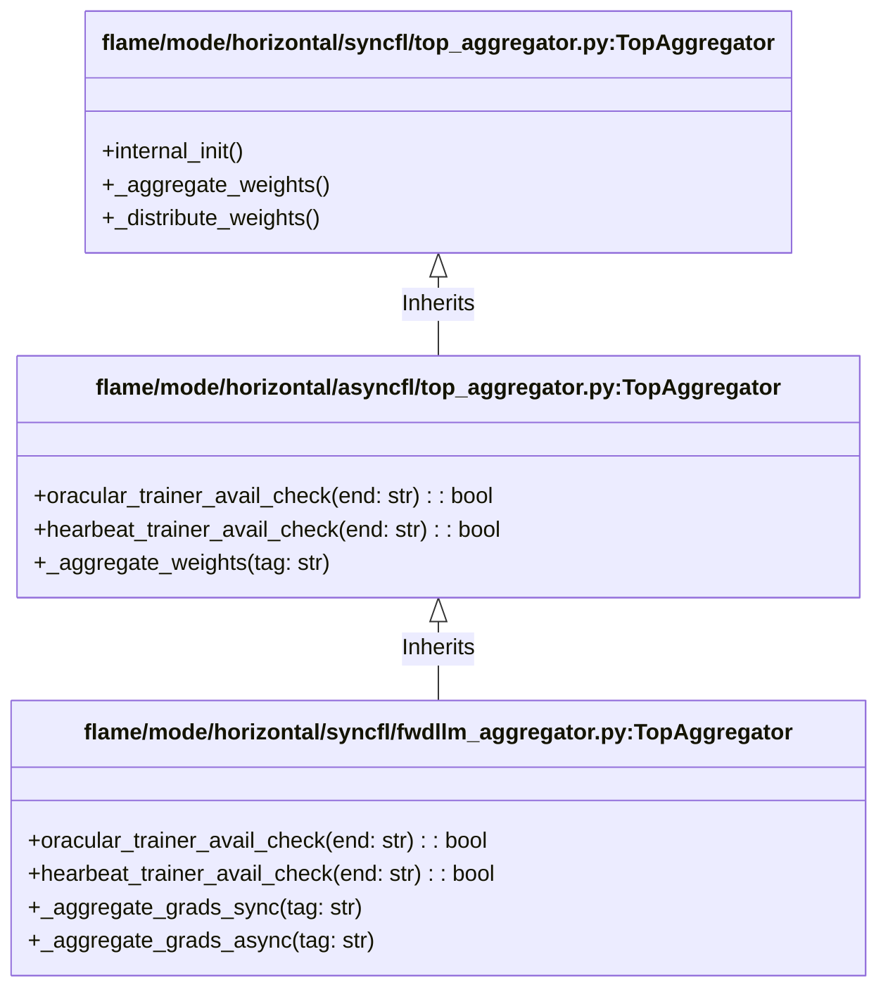

# Aggregator Class Hierarchy in FwdLLM

This document outlines the inheritance hierarchy of the Aggregator classes used in FwdLLM to help understand where specific methods are defined and why some might be redundant.

## Hierarchy Overview

Wait, let's correct the arrows to point from child to parent:

## Details on `oracular_trainer_avail_check`

The method `oracular_trainer_avail_check` is **NOT** present in the base synchronous aggregator (`SyncTopAgg`). 

It is first introduced in:
- `flame/mode/horizontal/asyncfl/top_aggregator.py` (as part of `AsyncTopAgg`).

It is then completely overridden in:
- `flame/mode/horizontal/syncfl/fwdllm_aggregator.py` (as part of the FwdLLM custom aggregator).

### Why the Redundancy?
The implementation in `fwdllm_aggregator.py` is nearly a complete duplicate of the one in `asyncfl/top_aggregator.py`. The **only differences are the logging levels**:
1. When removing a trainer from `trainer_unavail_durations` (list is empty):
   - `AsyncTopAgg`: `logger.info()`
   - `FwdLLMAggregator`: `logger.debug()`
2. When there's no info on `end` in `trainer_unavail_durations`:
   - `AsyncTopAgg`: `logger.debug()`
   - `FwdLLMAggregator`: `logger.info()`

Since `FwdLLMAggregator` inherits from `AsyncTopAgg`, deleting `oracular_trainer_avail_check` from `fwdllm_aggregator.py` entirely would simply cause it to fall back to the exact functional equivalent in `AsyncTopAgg`, minus the flipped log levels.
