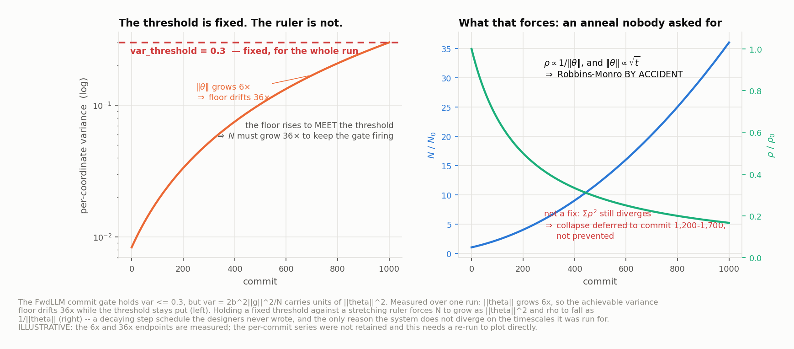
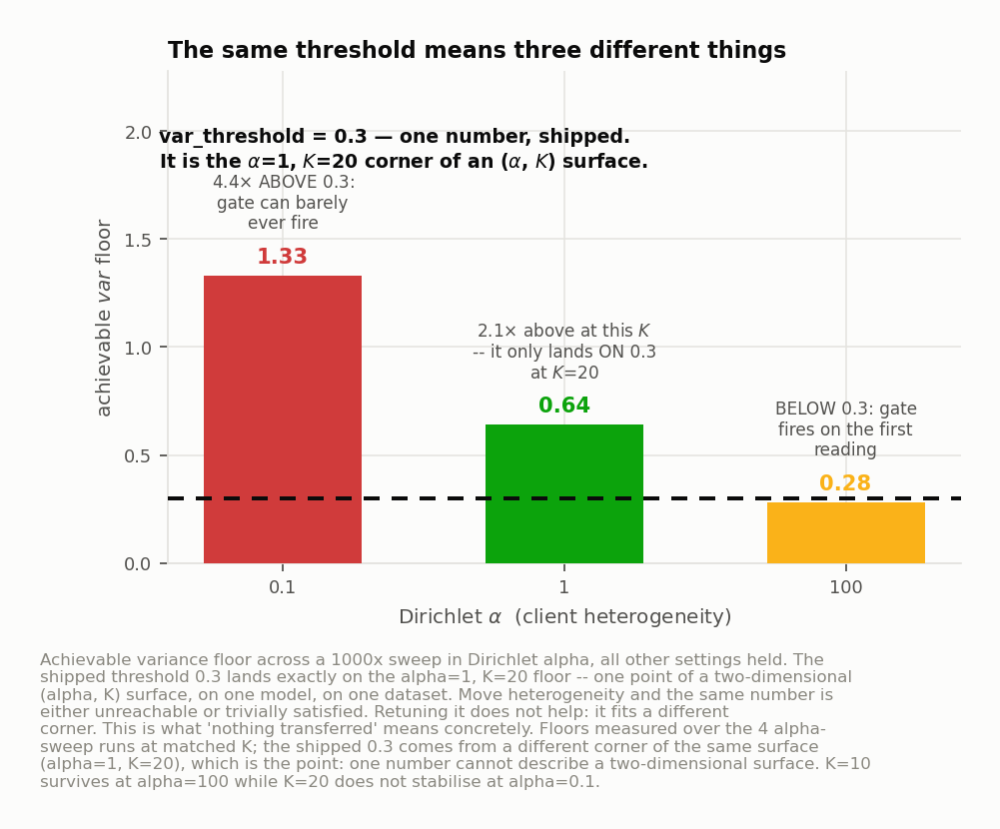
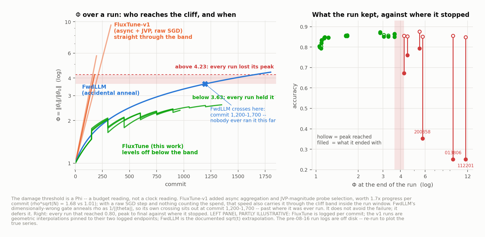
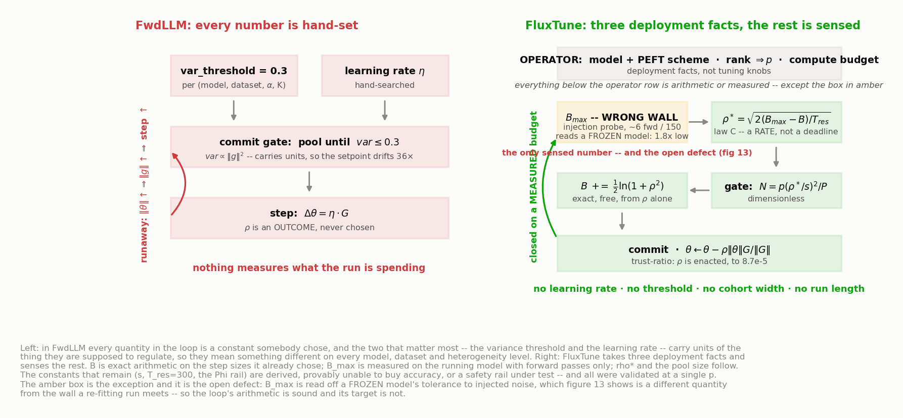
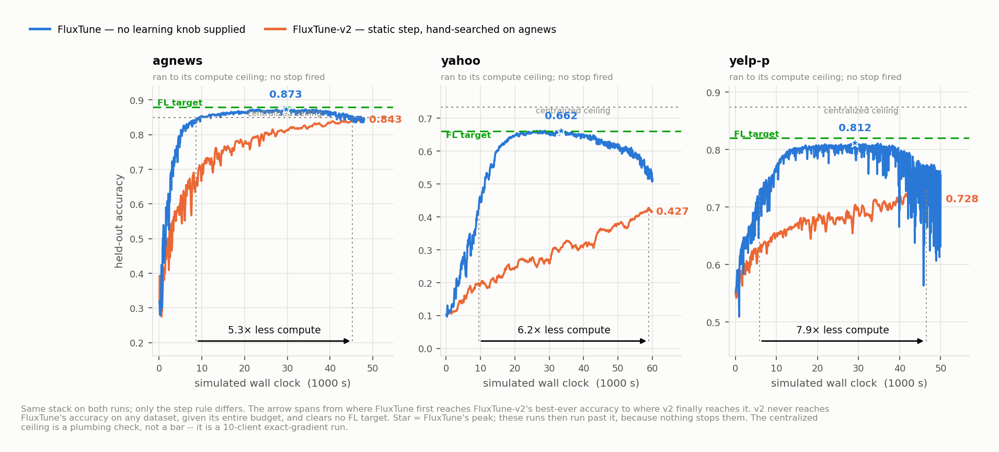
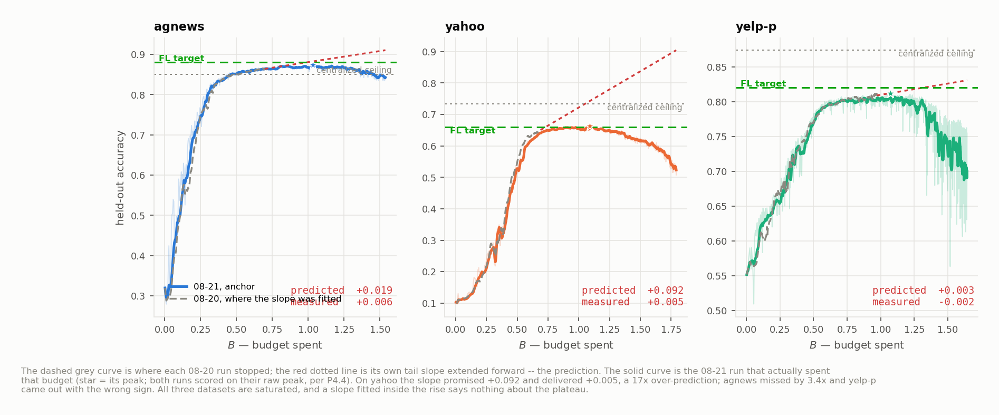
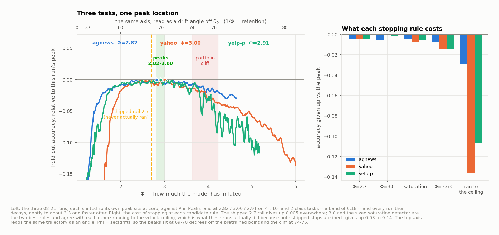
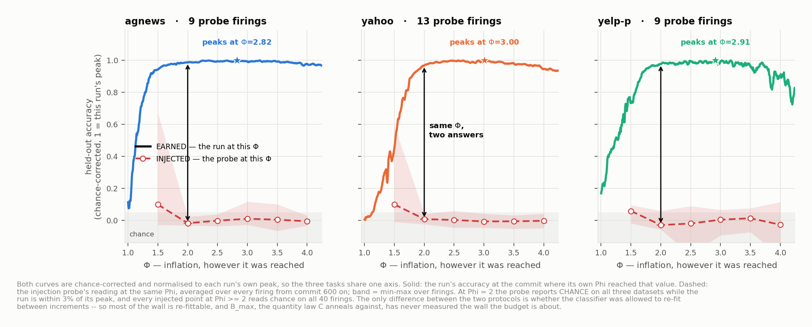

# FluxTune: Stability + Generality

---

## 0 · Lineage

```
  FwdLLM            variance-gate commit  ·  raw SGD step  ·  sync
  (prior work)      slow · never collapses in-window — BY ACCIDENT                     → §2

      +  async aggregation  +  JVP-magnitude probe selection
  FluxTune-v1       1.7× progress/commit · fastest to accuracy
  (ours, first)     ...then falls off a cliff. FwdLLM did not.                         → §3

      +  trust-ratio step  +  scale-free gate
  FluxTune-v2       runaway removed · but rho = 0.06 HAND-SEARCHED on agnews
  (ours, prev)      one constant, three datasets → does not transfer                   → §6

      +  rho set from a budget the run MEASURES ON ITSELF
  FluxTune          no learning knob at all
  (this work)       beats v2 on all 3 datasets · 5.3-7.9× less compute                 → §5,§6
                    ...and every run peaks at the SAME Phi ≈ 2.9                        → §7

  FL target         what the federated task should reach: .88 / .66 / .82
  backprop ref      exact gradients, CENTRALIZED — a plumbing check, not the target
```


---

## 1 · Scenario

- Fine-tune an LM across many clients, **never running a backward pass**. Clients evaluate forward only.
- Buys: **flat activation memory**, training on an **inference-only runtime**.
- Gradient without autograd: pick random direction `v`, nudge both ways

```
d = [ L(θ+h·v) − L(θ−h·v) ] / 2h     slope along v          (one scalar)
u = d · v                             one-sample gradient guess
```

- Catch: **`p ≈ 450,000` trainable dims.** A random direction there is ~perpendicular to the one you want. [Math: Stack exchange](https://math.stackexchange.com/questions/995623/why-are-randomly-drawn-vectors-nearly-perpendicular-in-high-dimensions)
- Pooling `N` guesses recovers alignment only as a **square root**:

```
cos( our step , true gradient )  ≈  sqrt( N·P / p )   →  N=200, P=10  →  ≈ 0.07
```

> ### Each step is ~7% signal, ~93% noise. Not "noisy but roughly right", *mostly sideways*, every step.

**Five symbols — and the first one is the villain.**

| | | |
|---|---|---|
| `g` | **the true gradient** `∇_θ L` on the trainable slice | **It has no fixed scale.** `‖g‖` is a *rate of loss change per unit of weight movement*, so it carries the loss's own scale, `‖θ‖` (exponent ≈0.9), the batch size and the model. Same model, same instant: **0.27–0.34** on 1024 held-out samples, **3.2–3.4** on one client's 8. **Every fixed constant in prior work is compared against something built out of `g`, and that is the bug** (§2.2) |
| `ρ` | **relative step**, a.k.a. the **trust ratio** — LARS/LAMB's term for this exact ratio | `‖Δθ‖/‖θ‖`; `ρ`=0.05 → "I trust this direction enough to move 5% of what I am". Because the step is ⟂ `θ`, it is also `tan` of the rotation this commit applies |
| `Φ` | **inflation ratio** | `‖θ_now‖/‖θ_start‖` — the weights swell while ~93% of the swelling buys nothing. Its reciprocal `1/Φ` is **retention** = `cos(θ_now, θ_start)`, so `Φ` is really a **rotation away from the pretrained point** (§7.4) |
| `B` | **budget spent** = `ln Φ` | `Φ` is multiplicative, `B` additive — which is the only reason `B_max − B` means anything |
| `Λ` | **progress banked** | the ~7% of all that movement that pointed the right way |

> **`ρ`, `Φ`, `B`, `Λ` and `cos` are *scale-free* — each is a ratio of two like things, so the scale
> cancels. `g`, `d`, `var(d)`, `h` and `η` carry a scale and are meaningless without one.** A shipped
> constant may only ever be compared against something in the first list. That single rule is the whole
> difference between this system and its predecessors.

**What "carries a scale" means, in one example.** This code's cross-entropy is a natural log, so the loss
is in nats. Had it been written with `log2` instead — same model, same data, same trajectory, *nothing*
about the learning changed, only the unit the loss is reported in — then

```
L, ‖g‖, d   ×1.4427            var(d)  ×2.081
```

⇒ FwdLLM's gate `var(d) ≤ 0.3` now fires after **half** as many probes, and the raw SGD step `η·G` is
**1.44× longer** at the same `η`. **A rule whose meaning changes when you relabel the loss axis is not a
statement about the model.** `ρ = ‖Δθ‖/‖θ‖` does not move at all: weight units over weight units, the
scale cancels. Neither do `Φ`, `Λ` or `cos`.

> And it is not a thought experiment. **With the unit held fixed, `‖g‖` still reads 0.30 and 3.3 at the
> same instant** depending on whether you mean the held-out gradient or one client's 8-sample batch — and
> the `var` floor drifts **36×** over a single run as `‖θ‖` grows 6× (§2.2). *That* is what a fixed
> threshold is being compared against.

---

## 2 · [Q1] Why FwdLLM fails

### 2.1 Noise has nowhere to go

- Step ⟂ `θ` ⇒ it **cannot shorten** the model. Pythagoras, exactly:

```
‖θ+Δθ‖² = ‖θ‖² + ‖Δθ‖²        cross-term measured 1.000 ± 0.005, every run
```

- ⇒ **weights grow every commit, forever.** The 93% doesn't cancel — it **accumulates as length**.

> **`1/Φ` = `cos(θ_now, θ_start)`** — the fraction of the model's current *length* still lying along where
> it started. (Not "the fraction that earned its accuracy": that is `Λ`'s job. §7.4 derives this.)
> At `Φ`=2.7 retention is 0.37 and the weights have rotated **68°** off the pretrained point. The head fails.

### 2.2 The scale bug. Every quantity carries units of `‖θ‖`

```
        ┌──────────────────────────────────────────────────────┐
        │                                                      │
   noise inflates θ  ──►  ‖g‖ grows (exponent ≈0.9 in ‖θ‖)  ──►  step Δθ ∝ η·G grows
        ▲                                                      │
        └──────────────────────── more noise ◄─────────────────┘
```

- Step was `Δθ ∝ η·G` ⇒ **`ρ` was an outcome, never a choice.** Loop is closed at commit 1.
- Visible ~commit 150. Ends the same way every time: reach 0.85, **hand it all back**, land at chance.

**The commit gate has the same issue.** FwdLLM pools until readings agree: `var(d) ≤ 0.3`. But

```
var  ≈  2·b²·‖g‖² / N          ⇒  (1) it is really an N-controller     (var ∝ 1/N)
                                  (2) IT CARRIES UNITS  (var ∝ ‖g‖²)
```

| | |
|---|---|
| **Within one run** | achievable variance floor drifts **36×** = (6× norm growth)² — the ruler stretches, the threshold does not |
| **Across α** | achievable floor **1.33 / 0.64 / 0.28** at α = 0.1 / 1 / 100. Threshold 0.3 sits *exactly* on the α=1, `K`=20 floor |
| **Across `K`** | `K`=10 can't reach the target at all (`max_iter` binds); `K`=20 doesn't stabilise at α=0.1 |
| **Across model** | `‖g‖` scale is model-specific ⇒ 0.3 means something different on every `p` |

> **So `var_threshold` = 0.3 is one point fitted to a 2-D (α, K) surface, on one model, on one dataset.**
> Any retune fits a different corner. **This is why nothing transferred.**

### 2.3 The bug was the only thing holding it up

- Fixed threshold + stretching ruler ⇒ forces `N ∝ ‖θ‖²` ⇒ `ρ ∝ 1/‖θ‖` ⇒ **a decaying step schedule.**
- `‖θ‖ ∝ √t` ⇒ that is **Robbins–Monro by accident.**
- **Not a fix:** `Σρ²= Σc/t` diverges logarithmically ⇒ collapse **deferred** (extrapolated commit **1,200–1,700**), not prevented.

> **The defect in one line: nothing in the pipeline is scale-invariant** — estimator, step, and gate all
> inflate together ⇒ **no quantity anywhere can be compared to a fixed number.**





> **Read the bars left to right:** the *same* number is unreachable at α=0.1, marginal at α=1, and fires
> on the first reading at α=100. **0.3 is one corner of an (α, `K`) surface** — and `K` moves it too.


### 2.4 And past a point the run gives everything back

- Of the **22 runs** that actually learned:
  - **every run below `Φ` = 3.63 held its peak** (worst loss 0.014)
  - **every run above `Φ` = 4.23 lost it** (0.083 → 0.604)
- Two runs ended at **half** the accuracy they reached: `112201` 0.849 → 0.250 · `013806` 0.855 → 0.251.
- The cliff is **sharp**, and **computable from step sizes alone**.

> **This is not a property of the broken systems.** Three controlled FluxTune runs, run deliberately past
> the rail, peak and then decay in the same way. **Setting `ρ` correctly does not remove the cliff — it
> only lets you choose where to stand relative to it.** Where that is, on every task we have run: §7.3.

---

## 3 · [Q2] Why FluxTune-v1 (async + JVP) was incomplete

### 3.1 What v1 added — and it worked

- **Async aggregation** (FedBuff lineage) → straggler tolerance.
- **JVP-magnitude probe selection** → picks the steepest measured direction, `G_rule ≈ 3` vs FwdLLM's ≈1.
- Measured: **`ρ·√N` = 1.68 (v1) vs 1.01 (FwdLLM)** at matched commits ⇒ **~1.7× progress per commit.**
- ⇒ **real time-to-accuracy win.** This is the part that stands.

### 3.2 Why it fell off a cliff and FwdLLM didn't

**Not a different failure — the same failure, arriving sooner.**

```
  the cliff is at a fixed Φ ≈ 3.6-4.2      ← not a clock reading
  v1 spends budget ~1.7× faster per commit  +  raw SGD step still runs away
  ────────────────────────────────────────────────────────────────────────────
  ⇒ v1 crosses the cliff INSIDE the run window
  ⇒ FwdLLM's crossing sits at commit 1,200-1,700 — past where anyone ever ran it
```

| system | why it looks the way it does |
|---|---|
| **FwdLLM** | slow per commit **+** accidental `1/‖θ‖` anneal ⇒ never reaches the cliff in-window. **Looks stable. Isn't.** |
| **FluxTune-v1** | fast per commit **+** no anneal (raw SGD) ⇒ reaches accuracy fast, **then reaches the cliff** |

**Receipts (ledger):**

| run | rule | peak → final | `Φ` at end |
|---|---|---|---|
| `200325` | raw_sgd control, select | 0.855 → **0.672** | 4.23 |
| `200358` | select, `rf`=16 | 0.852 → **0.353** | 5.74 |
| `013806` | select raw, N=200 +cos | 0.855 → **0.251** | 9.47 |
| `112201` | const `ρ`=.06, 1364 commits | 0.849 → **0.250** | 11.61 |

- §2.5 confirms it is **cross-baseline, not a v1 bug**: sync FwdLLM shows orthogonality 1.000 ± 0.008,
  same `ρ` at commit 1, ~106-commit norm doubling. **Same signature, shared `_server_update_step`.**

> **v1 didn't break FwdLLM's stability — it *exposed* it. Making the estimator better without a budget
> meter converts a deferred failure into an immediate one.** Speed is only safe if something is counting
> what the speed costs.

- Corollary: **the fix cannot be "go slower."** Lowering `η` pays 1:1 in progress, and *any* constant `ρ`
  still has `Σρ² = ∞`. Deferral is not prevention.



> Three trajectories, one shaded band. v1 goes through it at commit ~200.
> FwdLLM crawls toward it and would cross at 1,200–1,700 — off the end of any run anyone did. FluxTune
> levels off underneath it. *Left panel: FluxTune is logged per commit; the v1 runs are geometric
> interpolations pinned to their two logged endpoints; FwdLLM is the documented √t extrapolation — the
> pre-08-16 run logs are off disk. **Re-run to plot the true series.***

---

## 4 · Insight: Stop measuring in units that stretch

| what was wrong | replacement | what it buys |
|---|---|---|
| step size was an **outcome** of `‖g‖` | **trust-ratio step** `θ ← θ − ρ·‖θ‖·G/‖G‖` — we *set* `ρ` | `ρ` becomes a knob. α=1 vs α=0.1 → **identical `ρ` to 6 s.f.** |
| gate compared a **scale-carrying** quantity to a constant | **`n_target` gate**: pool until `N ≥ p(ρ/s)²/P` | same N-controller, stated **scale-free** |
| probes **selected** by `\|d\|` | **average all of them** | more signal per commit, free (`b²/a`=1 ⇒ selection gains nothing) |

**The chain, from one commit to the whole run.** Every link is forced by the perpendicularity in §2.1;
nothing here is a modelling choice:

```
  one commit  ── set rho ──►  the step IS a rotation of arctan(rho)          (⟂ ⇒ adding turns theta)
                              it EARNS   ΔΛ = rho · cos      (the aligned ~7%)  ── accuracy tracks Λ
                              it SPENDS  ΔB = ½ln(1+rho²)    (the turn it commits to)
  the run     ── sum ──────►  Φ = e^B = ‖θ_t‖/‖θ_0‖ = 1/cos(θ_t,θ_0)
                              so Φ is TOTAL ROTATION off the pretrained point, and 1/Φ is what's left of it
  the gate    ── holds ────►  cos = rho/s   ⇒   Λ = 2B/s     ── the exchange rate between the two ledgers
```

**Read it as one sentence:** *the step size is an angle, the budget is the total angle turned, retention is
what is left pointing where you started, and the exchange rate between spending and earning is a single
constant — so the only real decisions are how fast to spend and when to stop.* The full walk-through,
with each system's version of each step, is the solution doc **§5.0**.

**Two numbers describe any run.** Perpendicularity makes the trajectory an exact recursion
`‖θ_{t+1}‖² = ‖θ_t‖²(1+ρ_t²)`. Summing:

```
SPEND    B = ½ Σ ln(1+ρ_t²)      Φ = e^B     ← from step sizes ALONE. no gradients, no accuracy, no constants
EARN     Λ = Σ ρ_t·cos_t                     ← the useful ~7%
```

| fact | evidence |
|---|---|
| **Accuracy rises with `Λ`** | 21 runs sorted by `Λ`: peak climbs monotonically **0.377 → 0.876** |
| **Retention is decided by `Φ` alone** | peaks land at `Φ` = **2.41–3.11** (mean 2.71) across 2 step rules, 3 model sizes, α 0.1–1, 177–1,364 commits — and **2.82 / 3.00 / 2.91** on the three controlled runs taken deliberately past it |
| **`B` is an identity** | predicting `Φ` from step sizes: median miss **0.09%**. Only exception: server-momentum runs — correlated steps inflate faster, *exactly* as `Φ = exp(((1+β)/(1−β))B)` says (checked β=0.5, 0.75) |
| **Pre-registered, then held** | "if yahoo reaches 0.6–0.7 by `Λ`≈1.0 the curve transfers" → **yahoo read 0.657 at `Λ`=0.994**; agnews 0.868 at `Λ`=1.001 |
| **Pre-registered, then broke** | "yahoo has slope left, `ΔB`≈0.33 reaches 0.734" → it got `ΔB`=0.40 and gained **+0.005**. §7.1 is the retraction, and it is the most useful thing in this document |


> Under a gate holding `ρ ≤ s·cos`:  **`Λ = 2B/s`** — an identity, verified to −0.3% out of sample.
> ⇒ **the schedule cannot buy accuracy.** Same budget spent ⇒ same accuracy earned; schedules differ only
> in *how many commits* they take. **There is no schedule to tune.** Pick it for stability, not yield.

**What is left is one question:** *how fast do we spend, and when do we stop?*

---

## 5 · [Q3] What FluxTune needs from the operator

### 5.1 The spending rule (law C) — aim at whatever budget is left

```
ρ*_t  =  sqrt( 2·(B_max − B_t) / T_res )
```

- `T_res` is a **rate — commits of control resolution — NOT a deadline.**
- ⇒ **run length is never an input.** Step shrinks as budget is consumed, approaches `B_max` from below.

### 5.2 `B_max` is **measured on the running model**, not supplied

```
  every 150 commits, on a COPY:
     inject random noise scaled so the model grows by exactly Φ ∈ {1.5, 2, 2.5, 3, 3.5, 4}
     read held-out accuracy back                    ~6 forward passes, no gradients, 2-3 min
     find the Φ where accuracy falls apart          = Φ_knee
  headroom is measured FROM WHERE WE STAND, B accumulates FROM THE START:
     B_max  =  B_now  +  ln Φ_knee
```

### 5.3 The control loop

```
 ┌────────────────────────────────────────────────────────────────────────┐
 │                                                                        │
 │   [SENSED] B_max ──► ρ* = √(2(B_max−B)/T_res) ──► N = p(ρ*/s)²/P       │
 │      ▲  probe                    │ step size          │ pool size       │
 │      │  every 150                ▼                    ▼                 │
 │      │                     trust-ratio commit ── clients pool N probes  │
 │      │                              │                                   │
 │      │                              ▼                                   │
 │      └──────────────── B += ½ln(1+ρ²)   [exact, free]                   │
 │                                     │                                   │
 │                       stop when ────┴──► saturation  OR  Φ rail         │
 └────────────────────────────────────────────────────────────────────────┘
```

> **The two stops are designed and sized but not yet shipped**, and what runs today cannot fire either of
> them (§7.3). Every run in §6 therefore ended on its compute ceiling. Read the accuracy numbers as peaks,
> which is how §6 reports them.

### 5.4 The knobs

**(a) Operator supplies**

| input | why it is legitimate | depends on |
|---|---|---|
| model + PEFT scheme | it *is* the deployment | — |
| PEFT rank ⇒ `p` | device memory budget. **Inert for learning and for time** | hardware |
| compute budget | how long you're willing to pay for | you |
| dataset | it's the job | — |

> **No learning rate · no variance threshold · no cohort width · no run length · no target accuracy ·
> no probe count · no safety factor.** Each of those is a number that works on agnews/DistilBERT and
> silently means something else elsewhere.

**What a dev actually hands the system, end to end.** The list is short for a new *dataset* and honestly
longer for a new *model*.

| | **new dataset** — demonstrated on 3 | **new model** — never done, and this is the largest hole |
|---|---|---|
| **supply** | a `datasets.yaml` row (h5 paths, `num_labels`, `max_seq_length`, split sizes) · a partition build · a compute budget · `eval_max_samples` (a *cost* knob) | the model + PEFT scheme · the PEFT rank ⇒ `p` (a **device-memory** choice) · a compute budget |
| **derived at init, free** | `num_labels` from the label vocab · chance = `1/num_labels` · `p` and `‖θ_tr‖` off the model | same, plus `ρ_max` from gate reachability and `n_req` in closed form |
| **sensed during the run** | `B`, `Φ`, `Λ`, `N`, `ρ*` — all free · `B_max` from the probe (**and §7.5 says this one is wrong**) | same |
| **must be RE-DERIVED, and has not been** | nothing | `T_res`=300 · the `Φ` rail=3.0 · probe cadence 150 · saturation warm-up 400 · `h`'s chord ratio `h√p/‖θ_tr‖` (0.50 here, and it **moves with `p`**) · `Φ*`≈2.9 itself. **All six were sized at one `p` on one architecture** |

> **So the zero-input claim is exact for a task and provisional for a model.** Porting order, if someone
> does it: read `p` and `‖θ_tr‖` at init (free) → check `h√p/‖θ_tr‖` against 0.50 → measure `Φ*` (rows P1 /
> P1′, forward-only) → re-derive `T_res` at the new `p` → *then* launch a run.

**When does the probe run — before the job, or during it?** *During.* As shipped, `B_max` is an **in-run
sensor**, not an offline profiling step: it fires every 150 commits on a **copy** of the trainable slice,
~6 forward passes, no gradients, no clients, 2–3 min, and it declines to fire while the model is still at
chance. **A new dataset therefore needs no profiling run of any kind today** — that is what makes the
zero-input claim operational rather than aspirational.

**The fix inverts that, and improves it.** A probe that lets the model re-fit (row P1′) costs ~50 commits
*per grid point*, so it can only be **offline and once per model**; and if `Φ*` turns out to be a property
of the model (row P1), you measure it once in about a GPU-hour, set `B_max = ln Φ*`, and the in-run sensor
disappears. **End state: a new *model* costs one offline hour; a new *dataset* costs nothing but the data.**

*The step-by-step onboarding procedure — what to supply, what is read at init, what is sensed, and what
must be re-derived offline — is [fl_fwd_ft_practice.md](fl_fwd_ft_practice.md) **P11**, kept current there
rather than here.*

**(b) Fixed constants that remain**

| constant | value | where it came from | what it depends on |
|---|---|---|---|
| `s` (gate safety) | held constant | the Cauchy–Schwarz equality condition — **derived, not searched** | — |
| `T_res` | 300 | chosen for **well-posedness**, and `Λ=2B/s` says it *can't* affect accuracy — only commit count | pinned to one `p` ⚠ |
| `f` (stop fraction) | 0.95 | engineering margin — **and unreachable under a receding `B_max`** (§7.2b) | pinned to one `p` ⚠ |
| probe cadence | 150 commits | cost/resolution tradeoff | — |
| `Φ` damage rail | 2.7 → **3.0** | 2.7 came from the old diverging dynamics; 3.0 is where three controlled runs peak (§7.3) | **unknown — model or task?** §7.4 ⚠ |
| bootstrap `B_max` | `ln 2` | *"the model survives its weights doubling"* — weakest non-trivial claim, not a fit. Phase A spends `B`≈0.27 before the first real probe | — |

> **Honest line to say out loud:** the constants that survive are either **derived** (`s`), **provably
> unable to buy accuracy** (`T_res`), or **a safety rail we are actively testing** (`Φ*`).
> The one real hole: all of them were validated at a single `p`. **Generality is shown across *task*, not
> across *model*.** At `rf`=64 (`p`=118k) law C + the annealed gate stopped composing under any `T_res`.
>
> **And `Φ*` may not be a constant we chose at all.** If §7.4's hypothesis holds it is a *measurable
> property of the model* — which would move it out of this table entirely, into the sensed column.



> **Read the amber box as the open defect.** Everything below the operator row is either free arithmetic or
> a measurement — except `B_max`, which is measured on the *wrong wall* (§7.5). The loop's arithmetic is
> sound; its target is not.

---

## 6 · FluxTune beats its hand-tuned predecessor everywhere

Three datasets · DistilBERT + adapters · 100 clients · non-IID. **v2 is run unchanged on all three**, so the
experiment asks exactly: *does a hand-tuned constant transfer, and does a sensed one?*

| | **FL target** | **FluxTune** | FluxTune-v2 (full budget) | compute to match v2's *best ever* | backprop ceiling |
|---|---|---|---|---|---|
| agnews | 0.880 | **0.873** — −0.007 | 0.843 — −0.037 | **5.3× less** | 0.850 |
| yahoo | 0.660 | **0.663** — **cleared** | 0.428 — −0.233 | **6.2× less** | 0.734 |
| yelp-p | 0.820 | **0.812** — −0.008 | 0.728 — −0.092 | **7.9× less** | 0.874 |

**FluxTune lands within 0.008 of the FL target on all three and clears it on yahoo. v2 clears none.**

> **Two different numbers; only the first is the goal.** The **FL target** is what this task should reach
> in the federated setting — 100 non-IID clients, forward-only, adapters. The **backprop ceiling** is a
> *centralized* 10-client exact-gradient run on the same data path: a **check that the plumbing works**,
> not a bar to clear. Reading yahoo's 0.734 as a target was comparing 10 clients centralized against 100
> clients non-IID, and it is what made yahoo look like a failure when it is the one dataset over target.

> **These are the second, independent set of runs.** The first set — a different `B_max` combiner, roughly
> half the budget spent — read 0.868 / 0.657 / 0.814 and **5.5× / 6.5× / 8.5×**. The headline survives a
> change to the part of the controller that sets the step size, which is the strongest evidence here that
> it is not a tuning artifact.

### Why?

| budget actually spent | agnews | yahoo | yelp-p |
|---|---|---|---|
| FluxTune-v2, **full** budget | 0.107 | 0.119 | 0.111 |
| **FluxTune** | 0.697 | 0.690 | **0.970** |

- A fixed `ρ`=0.06 spends **≈0.11 of budget regardless of dataset** — that is what a hand-set constant
  *is*, by definition. FluxTune spends **6–9× more** of the same budget in the same wall clock.
- The **penalty** for under-spending is set by the task, not the guess: agnews saturates early (v2 still
  gets 0.843); yahoo needs far more and v2 **stalls at 0.428**.

> **The right amount of budget is not a constant, so it has to be sensed — and what it
> costs you to guess wrong is decided by the task you haven't seen yet.**



---

## 7 · What we got wrong, and what the next runs showed

**FluxTune throttles its own step. The probe was not the problem — the *averaging* was.**

| yelp-p headroom | f1 | 2 | 3 | 4 | 5 | 6 | 7 | 8 |
|---|---|---|---|---|---|---|---|---|
| **measured** `ln Φ_knee` | 0.250 | 0.595 | 0.683 | 0.415 | 0.253 | 0.236 | 0.217 | **0.246** |
| **what FluxTune used** (mean of all senses) | 0.250 | 0.373 | 0.378 | 0.276 | 0.184 | 0.132 | 0.100 | **0.084** |

- Probe says *"~0.25 of road left"* — **no downward trend, in all 40 firings now, all 3 datasets.**
- `mean` combiner says *"0.08 left"* — **2.9× understatement** ⇒ `ρ*` annealed **1.7× below** what the
  measurement supported ⇒ `B` crossed `0.95·B_max` ⇒ halt.

> **The run did not stop because it was out of road. It stopped because the headroom readings were averaged.**

**We then fixed it, and it bought nothing.** Switching to the latest sense roughly doubled the sensed
budget (agnews `B_max` 0.795 → 1.694) and the three runs spent it. Accuracy moved **+0.006 / +0.005 /
−0.002**, and time-to-v2's-peak did not improve either (8,257 → 8,604 vclock on agnews). This is `Λ = 2B/s`
being right a second time: **the throttle cost hours, and cost accuracy nowhere.**


### 7.1 We predicted where the extra budget would land. It didn't.

The three **08-20** runs stopped mid-rise, so we fitted `dAcc/dB` over the last 20% of each and
extrapolated forward. **Then we launched the runs that actually spent that budget.** Both gain columns are
measured on raw peak accuracy.

| | slope fitted | extra `B` actually spent | **predicted** gain | **measured** gain |
|---|---|---|---|---|
| **agnews** | 0.06 | +0.35 | +0.019 | **+0.006** — 3.4× over |
| **yahoo** | **0.23** | +0.40 | +0.092 | **+0.005** — **17× over** |
| **yelp-p** | 0.03 | +0.11 | +0.004 | **−0.002** — wrong sign |



> **All three datasets are saturated.** A tail slope fitted *inside the rise* says nothing about the
> plateau — the fit is measuring how fast the curve is still turning over, not a rate that continues.

This retracts the reading that yahoo was "still climbing" and had a budget problem. It did not:

- **All three are at their FL target** — within 0.008, and yahoo is over it. There is no accuracy left for
  the controller to find on any of them: not by spending more, not by raising the rail, and not by `s`,
  which only rescales the `Λ` axis of a flat curve.
- What remains is the gap to the *centralized* ceiling (yahoo −0.071, yelp-p −0.062). That is a question
  about forward-gradient estimation and adapter capacity in a 100-client non-IID setting — **a different
  paper's question**, not a controller defect.

**What the throttle actually cost, corrected: hours on all three, accuracy on none.**

### 7.2 Two deeper problems

**(a) The probe's ruler starts past the mark.** Grid is `Φ ∈ {1.5…4}`, sized from *offline* measurements.
Live: **the first point tested is already below the knee — on all 40 firings across three datasets.**
`Φ_knee` comes back pinned at **1.25–1.28**, which is the floor of an extrapolation off the grid's own
`(Φ=1, 1.0)` anchor; the four points at 2.5–4.0 do no work on any of them. ⇒ measured headroom is a
constant 0.21–0.30 ⇒ `B_max = B + 0.25` ⇒ **the target recedes exactly as fast as budget is spent.**


**(b) The "fixed budget" picture is wrong, at least as the sensor reads it.** The probe noises a model
that **cannot re-fit**; a run re-fits continuously. Headroom stays ~0.25 throughout, so budget behaves like
a **rate limit that is continually re-earned**, not a tank that drains — and **stopping on a cumulative
total has no fixed point at all.** With `B_rem` pinned at `r`, the stop `B ≥ f·(B+r)` needs

```
B  ≥  f·r/(1−f)  =  0.95 × 0.25 / 0.05  =  4.75      ⇒  Φ ≈ 116,  against a cliff at 3.6
```

**So the shipped budget stop cannot fire.** Whether that is the world or the instrument is not yet
settled — a grid that brackets the knee from below is the next experiment — but either way the run needs
a different reason to end.

### 7.3 Every run peaks at the same `Φ` — and both shipped stops are inert

Three runs, `anchor` and **nothing armed to halt them**, run straight past the rail:

| | peak acc | at `Φ` | at `Λ` | ran to `Φ` | gave back |
|---|---|---|---|---|---|
| **agnews** | 0.873 | **2.82** | 1.38 | 4.65 | −0.029 |
| **yahoo** | 0.663 | **3.00** | 1.46 | 6.00 | −0.137 |
| **yelp-p** | 0.812 | **2.91** | 1.43 | 5.17 | −0.107 |

**A band of 0.18 in `Φ` and 0.08 in `Λ` across 4-, 10- and 2-class tasks** — and it sits inside the
2.41–3.11 band the portfolio showed under the *old, diverging* dynamics. This is the most transferable
number in this work: **`Φ` says where to stand, and it says the same thing on every task we have run.**



**So the rail was too tight — by 0.2, not by 1.5.** Stopping at 2.7 costs 0.005 on all three; at P4's
3.63 it costs 0.008–0.015. **Ship 3.0** — as a number for now, and possibly as a *measurement* later (§7.4).

**And these runs had nothing that could stop them.** Neither shipped rule can fire: the budget stop is
unreachable under a receding `B_max` (§7.2b), and the fixed-`Φ` rail is coded as the *else* branch of that
same test, so on every FluxTune run ever run the 2.7 backstop was **dead code**. They ran until their
compute ceiling expired. §7.4 is why that happened and why they also never slowed down.

### 7.4 What `Φ` actually is — and why the runs neither slowed down nor stopped

**Three quantities share the letter, and the differences are the whole story.**

| | what it is | where it comes from |
|---|---|---|
| **`Φ_t`** the **inflation ratio** | `‖θ_t‖/‖θ_0‖` — how far the model has rotated off its starting point | **pure arithmetic on the step sizes we chose**: `B = ½Σln(1+ρ²)`, `Φ = e^B`. Exact, because every step is ⟂ `θ`. **No model, no data, no accuracy enters it.** Free |
| **`Φ_knee`** the **injected** wall | how much isotropic noise this model survives **in one shot, frozen** | **measured** — inject noise, read held-out accuracy back, ~6 forward passes. Reads **1.25–1.28** |
| **`Φ*`** the **earned** wall | where accuracy actually peaks along a trajectory | **read off a run** — 2.82 / 3.00 / 2.91. **~1.8× above `Φ_knee`, and §7.5 is why** |

> **`Φ` is a rotation, not a distance.** Steps are ⟂ `θ` and ~93% isotropic in `p`≈450,000 dimensions, so
> each step's overlap with the *fixed* vector `θ_0` is ~0.0015 and `⟨θ_t, θ_0⟩` is conserved at `‖θ_0‖²`:
>
> ```
> retention  =  cos( theta_t , theta_0 )  =  ||theta_0|| / ||theta_t||  =  1 / Phi
> ```
>
> | `Φ` | 1.25 | 2.00 | **2.82 / 2.91 / 3.00** | 3.63 | 4.23 |
> |---|---|---|---|---|---|
> | retention | 0.80 | 0.50 | 0.36 / 0.34 / 0.33 | 0.28 | 0.24 |
> | **drift angle** | 37° | 60° | **69° / 70° / 70°** | 74° | 76° |
>
> **So the headline reads: every run peaks when the trainable weights have rotated ≈70° off the pretrained
> point, and dies past ≈75°.** *(Derived from the same perpendicularity that makes `B` exact; the one-line
> check — log `cos(θ_t,θ_0)` — is queued as build-plan row P3′ and has not run.)*

**Naming — and each word is picked so its everyday sense *is* the mechanism.** "Odometer" is retired: a
run does not travel a distance, it accumulates a rotation.

| name | **a ratio of what** | why that English word |
|---|---|---|
| `ρ` **trust ratio** | this step's length over the model's own length | **trust**: how much of yourself you stake on one estimate. And it is *earned* — the gate sets `N ∝ ρ²`, so a bigger stake costs proportionally more evidence |
| `Φ` **inflation ratio** | the trainable slice's length **now** over its length **at init** | **inflation**: swelling without gaining substance. Each commit adds length ⟂ `θ`, ~93% of it noise — the vector grows while most of the growth buys nothing |
| `1/Φ` **retention** | the length still lying along `θ_0`, over the length now | **retention**: the fraction you still have. 0.33 = "a third of what I am now is what I started as." Of *length*, not of accuracy — `Λ` is what tracks earning |
| the `Φ` rail = a **retention floor** | — | "keep at least a third of your length pointed where you started" — an invariant, not a tuned trip-wire |

> **One number, three readings.** `Φ` is *length* (3× as long), `1/Φ` is *what is left of you* (a third),
> `arccos(1/Φ)` is *how far you turned* (70°). They are the same fact, because every step is ⟂ `θ`.

> **Is inflation bad? Is lower better? No — it is the price, and the design is about paying it on
> purpose.** The aligned 7% of a step arrives welded to the sideways 93%, so learning *requires* spending:
> `Φ`=1 is a model that never moved. There is a right amount, and the runs agree on it — peak at `Φ`≈2.9,
> under-spend and you leave accuracy unclaimed (v2 spends 0.11 of budget and clears no target, §6),
> over-spend and you hand it back (§2.4). **`Φ` is a fuel gauge, not a fault counter.**

*`ρ` and the trust ratio are not our coinage: LARS (You, Gitman & Ginsburg, arXiv:1708.03888, 2017) sets
`‖Δθ‖/‖θ‖` directly through a per-layer "local LR", and LAMB (You et al., ICLR 2020, arXiv:1904.00962)
names the ratio the trust ratio. The angular reading of weight-norm growth is Spherical Motion Dynamics
(Wan et al., arXiv:2006.08419, 2020). What is ours is the accounting built on it (§4) — the novelty split
is audited in the solution doc §7.4.*

So `Φ_t` is **dynamic but not adaptive**: a running total, updated every commit, that never looks at the
model or the task. That is the point — it is the one quantity in the stack carrying no units of `‖θ‖`,
`‖g‖`, `p` or the label set, which is why comparing it to a fixed number means anything at all.

**Then why does peak accuracy land at the same `Φ` on every task?** Because `Φ` is exactly `1/retention`
= `1/cos(θ_t, θ_0)`, so `Φ*` is asking *how far the pretrained representation can be rotated before it
stops functioning* — a question about **the model**, not about the labels being fitted. The task sets how
much `Λ` you bank per unit `B` and what accuracy that buys. It has no obvious reason to move where the
wall is.

> **Working hypothesis: `Φ*` ≈ 2.9 is a property of the model + PEFT scheme.** Supporting it: the 0.18 band
> across 2-, 4- and 10-class tasks at three very different accuracy levels; the `p`-ladder runs, which held
> their peaks at `Φ` = 3.04 (`p`=118k) and 3.28 (`p`=229k) across a **3.8× range in `p`**; and 22 historical
> runs across two step rules and α 0.1–1, none of which ever peaked outside [2.4, 3.3].
> **Against it:** the *offline* knee sweep read agnews ≈3.0–3.5 but yahoo and yelp-p ≈2.0–2.3 — dataset-
> dependent, and that measurement is what the whole "`B_max` must be sensed" design rests on. But it is the
> **injection** probe, so §7.5 says it is measuring the other quantity — and a 1.2-wide spread in an
> instrument that reads chance from `Φ`=2 up is not evidence about where a *re-fitting* model peaks. The
> two readings are not comparable, which is exactly what P1 re-measures.
> **If the hypothesis holds the controller collapses**: measure `Φ*` once per model with forward passes,
> then spend to it. No per-run sensing, no combiner, no receding target. **The experiment is about an hour
> of one GPU** — build-plan row **P1**.

**Why the runs did not make smaller and smaller steps.** Law C is supposed to anneal:
`ρ* = √(2(B_max − B)/T_res)` → 0 as `B` → `B_max`. It didn't, because `B_max` ran away from `B` at exactly
the rate `B` advanced (§7.2). Substitute the pinned `B_rem` = `r` ≈ 0.22:

```
ρ*  =  √(2r / T_res)  =  √(2 × 0.22 / 300)  =  0.0386      ← a CONSTANT
```

Measured `ρ` over the last 70% of all three runs: **flat at 0.034 ± 0.002**, drifting only −0.007 per
1,000 commits. `Σρ²` after commit 400 is **2.09 / 2.72 / 2.23**, against 0.51 / 0.53 / 0.99 for the
earlier runs.

**The residual sawtooth is the closed form, to four decimals.** Inside a probe window `B` advances against
a frozen `B_max`, so `ρ*` anneals from 0.0383 to 0.0298 — and at each fire `B_max` re-anchors to `B + 0.22`
and `ρ*` jumps straight back. Measured 0.0381–0.0387 and 0.0297–0.0299. **That is a limit cycle, not an
anneal:** every window ends exactly where the last one ended.

> **Law C degenerated into a constant step — which is precisely FluxTune-v1's failure mode (§3), reached
> from the opposite direction.** A constant `ρ` has `Σρ² = ∞`, so `B` grows linearly, `Φ` grows
> exponentially in commits, and the cliff is crossed with certainty. The anneal was never disabled; it was
> **starved of the shrinking target it anneals against.**

**Why they did not stop when they stalled.** Same root, two branches — and one coding accident:

```
Φ_knee pinned at 1.25  ⇒  B_rem = ln 1.25 = 0.22, constant
   ⇒ ρ* constant                                        → never slows down
   ⇒ "B ≥ 0.95·B_max" needs B ≥ 0.95r/0.05 = 4.75       → never fires
   ⇒ and the Φ rail sits in the `else` branch of that same test → never even evaluated
```

**All three runs therefore had no rule that could end them, and no rule that could slow them.** They ran
until the compute ceiling expired. Everything they gave back — 0.03 / 0.14 / 0.11 — comes from that, and
**all of it traces to one number the sensor was reporting wrong.**

### 7.5 The deeper defect: we were measuring the wrong wall

**§7.2 said the probe's grid started past the mark. That was true, and it was the shallow half.** The
probe injects noise into a model and reads it back **frozen**. A run adds the same total length in ~1,000
increments **with the head re-fitting between every one.** Those are not the same experiment, and they do
not give the same answer.

Both columns below are chance-corrected and normalized to each run's own peak. *traj* is the run's accuracy
at the commit where `Φ` hits that value; *inj* is the mean over every probe fire from commit 600 on.

| `Φ` | agnews traj / inj | yahoo traj / inj | yelp-p traj / inj |
|---|---|---|---|
| 1.5 | **0.94** / 0.10 | **0.45** / 0.10 | **0.73** / 0.07 |
| 2.0 | **0.99** / −0.02 | **0.97** / 0.01 | **0.98** / −0.04 |
| 2.5 | **0.99** / −0.00 | **1.00** / 0.00 | **0.99** / −0.01 |
| 3.0 | **1.00** / 0.01 | **1.00** / −0.01 | **1.00** / 0.01 |
| 4.0 | 0.97 / −0.01 | 0.95 / −0.00 | 0.90 / −0.03 |

> **At `Φ`=2 the probe says the model is at chance. The run at `Φ`=2 is within 3% of its peak — on all
> three datasets.** Every injected point at `Φ` ≥ 2.0 reads chance, on all 40 fires.



> **The two curves are the same axis, the same model and the same accuracy metric.** The only difference
> is whether the classifier was allowed to re-fit between increments. **That gap is the whole of §7.4.**

**Three things follow, and the third is why the queue changed.**

1. **`Φ_knee`'s pinning is now doubly explained.** 35 of 40 fires are below the half-accuracy level at the
   *first* grid point, so the knee is an extrapolation off the grid's own `(Φ=1, 1.0)` anchor and returns
   1.25 by arithmetic. §7.2 had the arithmetic. This is why the first point was low.
2. **The gap is a measurement, and it is the interesting one.** Injected drift is fatal at 60°; earned
   drift is *optimal* at 70°. The only difference between the protocols is whether the classifier was
   allowed to follow. **So most of the wall is re-fittable** — which is a statement about fine-tuning, not
   about this controller.
3. **Re-ranging the grid fixes the receding target and not the calibration.** A bracketing grid will return
   an honest 1.2–1.6 instead of a pinned 1.25. It will still be **~1.8× below** the `Φ*`≈2.9 the same runs
   peak at. `B_max` is what law C anneals against, so this — not the grid range — is the deepest cause of
   §7.4's constant step.

> **Said plainly: the instrument that sets the budget has never measured the quantity the budget is
> supposed to be.** The fix is one of two cheap experiments — measure `Φ*` once per model (row **P1**), or
> build a probe that lets the model re-fit before reading it back (row **P1′**, `m`≈50 commits per grid
> point). Both are forward-only. Neither has run.

## 8 · What we change next

> **The queue lives in [fl_fwd_ft_buildplan.md](fl_fwd_ft_buildplan.md) §3 — that table is the single
> source of next steps, with a falsifier and a done-when for every row.** This section is the prose
> version; row letters below are its row letters. Nothing is scheduled here.

**One defect is behind everything §7 describes**, so the first two rows are the same fix seen from two
sides:

| row | what | why it comes first |
|---|---|---|
| **P1** | **Is `Φ*` a property of the model or of the task?** Inject noise on a bracketing grid at three PEFT ranks × three datasets. Forward-only, ~1 h, **no training run needed** | if `Φ*` is a model constant, `B_max = ln Φ*` is measured once and the per-run sensor, the combiner and the receding target all disappear (§7.4) |
| **P1′** | **Build a probe that lets the model re-fit** — inject at `Φ`, run `m`≈50 commits, *then* read accuracy back. `m`=0 is the positive control | §7.5: the shipped probe reads chance from `Φ`=2 up while the run at `Φ`=2 is at 0.97–0.99 of peak. `B_max` is what law C anneals against, and it has never measured the right quantity |
| **N4a′** | **Re-range the probe grid** to `Φ ∈ {1.05 … 2.0}` | 40 firings read below the first grid point, so the sensor returns its own extrapolation floor. This removes the *receding target*; §7.5 says it does **not** fix the calibration, so it is necessary and not sufficient |
| **P2′** | **Is `Φ*` the same centralized?** Same forward-gradient estimator, 1 client, IID | if `Φ*` is a property of the model it must not move with federation. Heterogeneity is a step-size multiplier only, and 22 runs across α 0.1–1 never peak outside [2.4, 3.3] — but nobody has removed FL and looked |
| **P3′** | **Log `cos(θ_t, θ_0)`** — one dot product per commit | the whole angular reading of `Φ` (peak at ≈70° of drift) is *derived* from perpendicularity and never measured. Free to check |
| **A** | **Restore the anneal**, only if N4a′ does not restore it by itself | a constant `ρ` has `Σρ² = ∞`; the run is guaranteed to cross the cliff |
| **S** | **Make the `Φ` rail reachable** — an `OR`, not the `else` of the budget test — and set it to **3.0** | the shipped 2.7 backstop has never executed on any FluxTune run |
| **E** | **Stop on saturation.** GL on an 11-eval trailing mean, threshold 0.005, patience 20, armed after commit 400. **Sized by replay** | fires within 0.008 of every peak, saving 38–55% of the run. Must land whatever P1 and N4a′ find — a backstop that depends on the sensor being right is not a backstop |

**S and E are backstops and must hold regardless.** P1 and P1′ are the fix, N4a′ is hygiene that was
mistaken for the fix, and S and E are what catches the next thing we get wrong about the sensor. **If both
P1 and P1′ fail, E stops being a backstop and becomes the primary sensor** — a peak detector would then be
the only instrument that ever sees `Φ*`.

**Not on this list, deliberately.** Raising the rail to the portfolio cliff at 3.63–4.23: measured, it
costs accuracy rather than buying it. And chasing the residual gap to the *centralized* ceiling with the
controller — all three datasets are already at their FL target and flat in `B`, so the next axis is **a
second model** (rows **N5a–N5c**, which walk the porting order rather than jumping to a run), not a
better schedule.

**Never an input, at any point: a target accuracy.** Stopping *at* a supplied number makes that number a
knob and voids the zero-input claim. Where saturation lands is a **result**. The FL targets in §6 are how
we *score* these runs, and the controller has never been told them.

## 9 · Honest boundaries (say these before they ask)

- **The budget sensor has never measured the quantity the budget is** (§7.5) — it reads a frozen model's
  tolerance to injected noise, ~1.8× below where a re-fitting run peaks. Every failure in §7.4 traces to
  it, and we previously mis-described it as a conservative *offset*.
- **One model throughout — the largest hole.** All six runs are DistilBERT + adapters at the same `p`, and
  the three datasets differ in `p` by 1.4%. At `rf`=64 law C + the annealed gate stopped composing under
  any `T_res`. **Generality is shown across *task*, not across *model*.**
- **`Φ*`≈2.9 is measured on three tasks at essentially one `p`.** It replicates the portfolio's 2.41–3.11
  band and the `p`-ladder is consistent with it, but **"consistent with" is not "law"** — and we do not yet
  know whether it is a property of the model or of the task (§7.4). Most consequential unknown here, and
  one GPU-hour away.
- **`Φ*` has only ever been measured inside FL.** Nothing suggests federation moves it — heterogeneity is a
  step-size multiplier and 22 runs across α 0.1–1 stay inside [2.4, 3.3] — but the centralized
  forward-gradient control (row P2′) has not been run. The *backprop* comparison is not the same question:
  backprop's steps are not ⟂ `θ`, so it banks the same `Λ` at `Φ`≈1 and never approaches the wall at all.
  **The wall belongs to the model; the bill belongs to the estimator.**
- **The angular reading of `Φ` is derived, not measured.** "Peaks at ≈70° of drift" follows from the same
  perpendicularity that makes `B` exact, but `cos(θ_t, θ_0)` has never been logged — one dot product per
  commit, row P3′. Until it runs, `Φ` is the load-bearing quantity and the angle is exposition.
- **Two remain below the *centralized* backprop ceiling** (yahoo −0.071, yelp-p −0.062), and **neither is a
  budget problem** — we tested that directly and both are flat in `B`. That residual is about
  forward-gradient estimation and adapter capacity under 100-client non-IID, undiagnosed. Note we changed
  what we score against mid-project: the ceiling is centralized and 10-client, and treating it as the bar
  is what made yahoo look like the failure case when it is the one dataset over target.
- **We published a prediction and it was wrong** (§7.1). The tail slopes were pre-registered, the runs
  refuted them by up to 17×, and the table shows both columns. **Do not extrapolate a slope fitted inside
  a rise.**
- **"Reaches and *holds* a plateau" is true of the trajectory and not yet of the system** — every run ran
  past its peak because both shipped stops were unreachable (§7.3), and the replacement is designed and
  sized but not shipped. Two caveats on how that gets scored: **"ends within 0.015 of peak" is weaker than
  it sounds** (a still-climbing run passes trivially — these runs fail it, for the right reason), and **no
  run in *this* set collapsed**, so they show the stop would be *efficient*, not that it *saved* them.
  Damage itself is not in doubt: 6 wider-portfolio runs lost 0.083–0.604 past `Φ`=4.23.

## 10 · Summary — the four beats

| | |
|---|---|
| **Problem** | forward-gradient steps are 93% noise ⟂ to `θ` ⇒ noise accumulates **as length** and cannot cancel |
| **Why prior work "worked"** | its commit gate compared a `‖θ‖²`-carrying quantity to a fixed number — an **accidental** decay that deferred collapse, and meant something different on every task |
| **Formulation** | perpendicularity makes the trajectory exact ⇒ two scale-free numbers, spend `B` (`Φ=e^B`) and earning `Λ`. Accuracy rises with `Λ`; retention is governed by `Φ`; **`Λ = 2B/s` ⇒ the schedule cannot buy accuracy, so there is nothing in it to tune** |
| **System** | set the step from **budget remaining**, at a *rate* not a deadline (⇒ run length never an input); **measure** the budget on the running model, forward passes only |
| **Evidence** | 3 datasets, **all within 0.008 of their FL target and one over it**, at **5.3–7.9× less compute** than the same stack with a hand-searched step, **replicated across two combiners**; v2 clears no target on any dataset; budget law predicts measured growth to **0.23%** |
| **Open** | **the budget sensor measures the wrong wall.** It reads a *frozen* model's tolerance to injected noise; a run re-fits, and peaks ~1.8× further out (§7.5). `B_max` therefore recedes, law C degenerated to a constant step, and neither stop could fire — every run ran past its peak and gave back 0.03–0.14 from that one cause. Two cheap forward-only fixes: measure `Φ*` once per model, or let the probe re-fit. Beyond it: **is `Φ*`≈2.9 — peak at ≈70° of drift — a property of the model?** |

---

## Appendix · Figure index

| fig | shows | where |
|---|---|---|
| 8 | **The stretching ruler** — fixed threshold against a floor that drifts 36× | §2.3 · Q1 |
| 9 | **One threshold, three meanings** — the α sweep against the shipped 0.3 | §2.3 · Q1 |
| 1 | Noise compounds — perpendicularity, and what it costs past the cliff | §2.4 |
| 10 | **Fast is not safe** — Φ trajectories of all three systems against the cliff band | §3.2 · **Q2** |
| 2 · 3 | The budget law is exact · accuracy rises with `Λ` | §4 |
| 11 | **Who sets what** — hand-set loop beside the sensed loop, with the one broken sensor flagged | §5.3 · Q3 |
| 4 | FluxTune versus FluxTune-v2, three datasets | §6 |
| 5 | The combiner throttles the step | §7 |
| 7 | **Predicted versus measured** — the tail-slope extrapolation against the runs that tested it | §7.1 |
| 6 | The ruler starts past the mark — the probe grid | §7.2 |
| 12 | **Where every run peaks** — `Φ` at peak on three tasks, and what each stopping rule costs. Its top axis reads the same trajectory as a drift angle | §7.3 |
| 13 | **Injected is not earned** — the probe's curve against the run's own, at the same `Φ`. The figure the whole open defect turns on | §7.5 |

**Regenerate:** `expt_scripts/writeup_figs/make_figures.py [n ...]` (run `extract.py` first if the
`data/` cache is cold).

**Two panels are illustrative, not logged** — the pre-08-16 run logs are off disk, so fig 8 carries the
measured 6×/36× endpoints on the laws that produced them, and fig 10's v1 / FwdLLM curves are an
interpolation and an extrapolation respectively. **Both need a re-run to plot directly.** Every other
number and series in this document is logged.

**Which runs each figure draws.** Figures 4, 7, 12 and 13 use the 2026-08-21 runs (`anchor`, both stops in
log-only, run to the compute ceiling); figures 5 and 6 use the 2026-08-20 runs, which is where the combiner
and probe-grid defects were found; figures 2, 3 and the cliff bands come from P4's 22-run ledger via
`ledger.py`, so they can never drift from it.