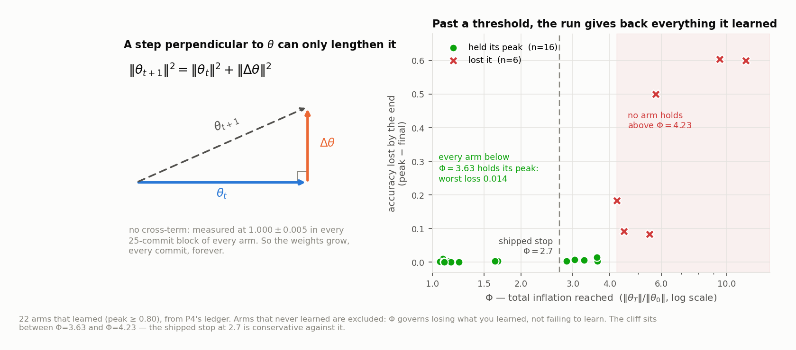
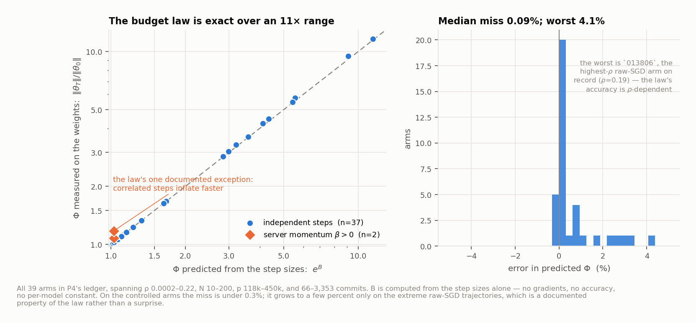
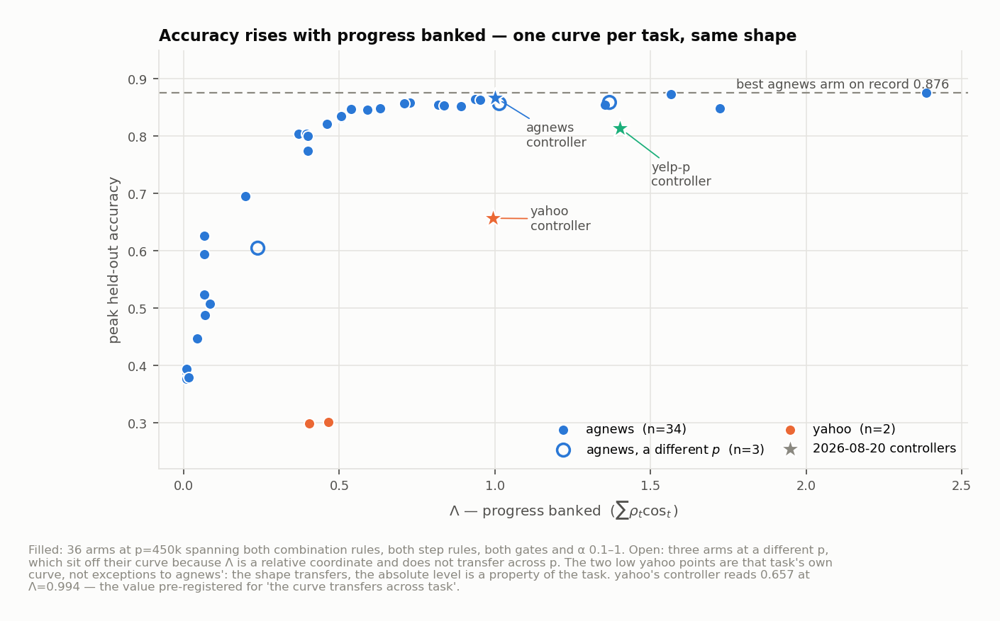
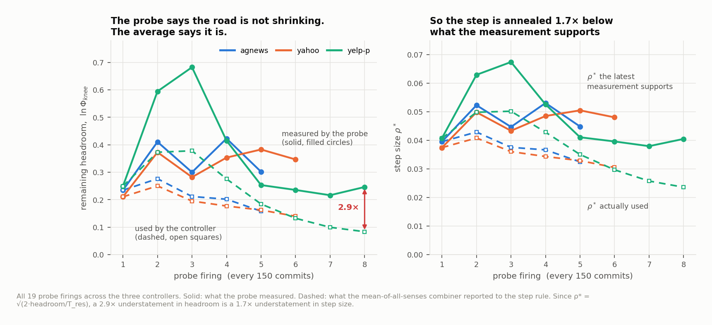
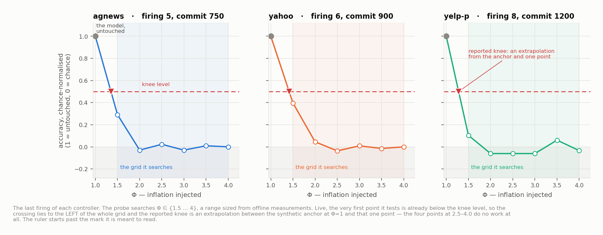

# Fine-tuning without backprop: why it fell over, and the controller that fixes it

*Read this top to bottom. Every number is from a logged run; the run id is given so it can be checked.
The companion documents hold the full derivations and the complete evidence — this one holds the argument.*

---

## 1. What we are doing, and why it is hard

We fine-tune a language model across many clients **without ever running a backward pass**. Clients can
only evaluate the model forward. This buys flat activation memory and lets training run on an
inference-only runtime.

To get a gradient without autograd, a client picks a **random direction** `v`, nudges the weights both
ways, and measures how the loss changed:

```
d  =  [ L(θ + h·v) − L(θ − h·v) ] / (2h)     ≈  how much the loss slopes along v
u  =  d · v                                   ≈  a one-sample guess at the gradient
```

Averaged over many random directions this points the right way. The catch is **how many is "many."** The
trainable slice here has `p ≈ 450,000` dimensions, and a random direction in 450,000 dimensions is
almost perpendicular to the one you want. Pooling `N` such guesses recovers alignment only as a square
root:

```
cos( our step , true gradient )  ≈  sqrt( N · P / p )     — with N ≈ 200, P = 10, this is ≈ 0.07
```

> **The one fact everything follows from: each step is ~7% signal and ~93% noise.**
> Not "noisy but roughly right" — *mostly sideways*, every single step.

**Symbols.** Only four are needed.

| | |
|---|---|
| `ρ` | **step size relative to the model**: `‖Δθ‖ / ‖θ‖`. `ρ = 0.05` means "move 5% of your own length" |
| `Φ` | **how much the model has grown**: `‖θ_now‖ / ‖θ_start‖` |
| `B` | **budget spent** — defined in §4, and `Φ = e^B` |
| `Λ` | **progress banked** — the useful part of all that movement |

---

## 2. The failure: noise has nowhere to go, so it piles up

Because each step is almost perpendicular to where the model already is, it cannot shorten the model — it
can only lengthen it. Pythagoras, exactly:

```
‖θ + Δθ‖²  =  ‖θ‖²  +  ‖Δθ‖²          (the cross-term is zero; measured at 1.000 ± 0.005, every arm)
```

So **the weights grow, every commit, forever.** The 93% that was noise does not cancel out over time — it
accumulates as *length*.

That gives `Φ` its meaning, and it is the intuition worth keeping:

> **`Φ` is the reciprocal of how much of the model is still the part that earned its accuracy.**
> At `Φ = 2.7`, roughly **1/2.7 ≈ 37%** of the model's length is signal and the rest is accumulated
> junk. The classifier head is then sitting ~68° away from the direction that used to work, and it fails.

**And in the old system this ran away.** The step was `Δθ ∝ η·G`, so `ρ` was an *outcome*, not something
anyone chose. A longer weight vector produces a larger gradient (measured: `‖g‖` tracks `‖θ‖` with
exponent ≈0.9), a larger gradient produces a longer step, and a longer step adds more length:

> noise inflates the model → the gradient grows → the step grows → more noise

The loop is closed. It is present at commit 1 and becomes visible around commit 150 — the steps never
become *more wrongly aimed*, they just become *bigger*, applied to a model that keeps getting longer.
Left alone it ends the same way every time: an arm reaches 0.85 and then **hands it all back**, landing at
its dataset's chance level.



**And when it grows too far, the run gives everything back.** Of the 22 arms on record that actually
learned, **every one below `Φ` = 3.63 held its peak** — worst loss 0.014 — and **every one above
`Φ` = 4.23 lost it**, by 0.083 to 0.604. Two arms ended at half the accuracy they had reached
(`112201`: 0.849 → 0.250; `013806`: 0.855 → 0.251). The cliff is real, it is sharp, and it is located
in a quantity computable from the step sizes alone.

### 2.1 The old system survived by accident

The prior system (FwdLLM) decides when to commit by pooling until the readings agree: `var(d) ≤ threshold`.
Working that out, `var ≈ 2·b²·‖g‖²/N`, which says two things:

1. It is really a **pool-size controller** — `var ∝ 1/N`.
2. **It carries units.** `var ∝ ‖g‖²`, and `‖g‖` grows with the model, so the variance floor drifted **36×**
   over one run — exactly the square of the 6× norm growth.

Because the ruler stretches while the threshold does not, holding `var ≤ c` forces the pool to grow like
`‖θ‖²`, which forces `ρ ∝ 1/‖θ‖`, which is a **decaying step schedule — by accident.**

> **The units bug was the only thing holding the system up.** And it is not a fix: the decay is too slow
> to prevent collapse (it defers it to ~commit 1,200–1,700), and because the threshold has units it means
> something different on every model, dataset and run length. **This is why nothing transferred.**

**The defect in one line: nothing in the pipeline is scale-invariant** — the readings, the step, and the
gate all inflate together, so no quantity anywhere can be compared against a fixed number.

---

## 3. The fix, in one idea

**Stop measuring anything in units that stretch.** Three replacements make every quantity a pure ratio:

| what was wrong | replacement | what it buys |
|---|---|---|
| step size was an *outcome* of the gradient magnitude | **trust-ratio step**: `θ ← θ − ρ·‖θ‖·G/‖G‖` — we *set* `ρ` directly | `ρ` becomes a knob. Client heterogeneity now moves it by *zero to six decimal places* |
| commit gate compared a quantity with units to a constant | **`n_target` gate**: pool until `N ≥ p·(ρ/s)²/(P)` | the same pool-size controller, stated dimensionlessly |
| probes were *selected* by `|d|` | **average all of them** | more signal per commit, for free |

That removes the runaway. It does not answer the remaining question, which is the whole rest of the
problem: **how big should `ρ` be, and when should we stop?**

---

## 4. Two numbers describe any run

With steps perpendicular to `θ`, the trajectory is an exact recursion `‖θ_{t+1}‖² = ‖θ_t‖²(1+ρ_t²)`.
Summing it gives one number for what a run **spends** and one for what it **earns**:

```
SPEND     B  =  ½ · Σ_t ln( 1 + ρ_t² )        and       Φ = e^B
EARN      Λ  =  Σ_t  ρ_t · cos_t              ( the ~7% of each step that pointed the right way )
```

Both are dimensionless, both are exact at any point in the run, and **`B` is computable from the step
sizes alone** — no gradients, no accuracy, no model-specific constant.

Two empirical facts turn this into a control problem:

**(a) Accuracy rises with `Λ`.** Over 21 runs sorted by `Λ`, peak accuracy climbs monotonically from 0.377
to 0.876. `Λ` is how far you travelled *usefully*, measured in multiples of your own length.

**(b) Whether you keep what you learned is decided by `Φ` alone.** Two readings of the same portfolio,
and it is worth keeping them apart:

- **where accuracy peaks** — every run that learned, turned over, and still had time left peaked at
  **`Φ` = 2.41–3.11** (mean 2.71), across two step rules, three model sizes, α from 0.1 to 1, and run
  lengths from 177 to 1,364 commits;
- **where it is lost** — below **`Φ` = 3.63** every such run held its peak to within 0.014; above
  **`Φ` = 4.23** not one did (Figure 1).

Neither number was fitted to anything: `Φ` is computed from the step sizes, and the peak location was
never used to choose a single constant.



**`B` is not a model — it is an identity that the runs obey.** Predicting `Φ` from the step sizes alone,
across every arm on record, the median miss is **0.09%**. The one visible exception is the pair of
server-momentum arms: correlated steps inflate faster, exactly as the law says they must
(`Φ = exp(((1+β)/(1−β))·B)`, checked at β = 0.5 and 0.75).



The relationship was **pre-registered before the three-dataset runs**: if yahoo reached 0.6–0.7 by
`Λ ≈ 1.0`, the curve transfers across task; if it stalled near 0.35 with `Λ > 1.0`, it does not.
**yahoo read 0.657 at `Λ` = 0.994.** agnews reads 0.868 at `Λ` = 1.001.

### The problem, restated

> There is a budget. Spending it buys accuracy; overspending destroys what you bought.
> **How fast do we spend, and when do we stop?**

And there is a clean answer to the first half. Under a gate that keeps `ρ ≤ s·cos`, the exchange rate is
fixed:

```
Λ  =  2B / s          — an identity, not a fit  (verified to −0.3% out of sample)
```

> **This is the load-bearing simplification.** It says **the schedule cannot buy accuracy.** Two step
> schedules that spend the same budget earn the same accuracy and differ only in how many commits they
> take. So there is *no schedule to tune* — we are free to pick one for stability rather than for yield,
> and the only real lever on accuracy-per-budget is `s`.

---

## 5. The controller

**Spending rule (law C).** Aim the step at whatever budget is left:

```
ρ*_t  =  sqrt( 2 · (B_max − B_t) / T_res )
```

`T_res` is a **rate — how many commits of control resolution we want — not a deadline.** That distinction
is what removes the run length from the inputs: nobody has to say how long training will take. The step
naturally shrinks as the budget is consumed, and approaches `B_max` from below.

**Where `B_max` comes from — it is measured, not supplied.** Add random noise to the weights, scaled so the
model grows by exactly `Φ`; read held-out accuracy back; find the `Φ` at which accuracy falls apart. Six
forward passes on a copy, no gradients. Repeat every 150 commits.

Because the probe measures headroom *from where the model stands now*, while `B` accumulates from the
start:

```
B_max  =  B_now  +  ln Φ_knee
```

**What an operator supplies: no learning knob at all.** No learning rate, no variance threshold, no cohort
width, no run length, no target accuracy. Only a description of the dataset and a compute budget.

---

## 6. It works: the controller beats a hand-tuned baseline on every dataset

Three datasets, one model (DistilBERT + adapters), 100 clients, non-IID.

- **Controller** — the stack above, given no `ρ` and no `B_max`.
- **Baseline** — the same stack with the hand-tuned setting that was *searched on agnews* (`ρ` = 0.06,
  decaying), run unchanged on all three.

So the experiment asks exactly: **does a hand-tuned constant transfer to a new task, and does a sensed one?**

| | controller | baseline (full budget) | compute to match the baseline's *best ever* | backprop reference |
|---|---|---|---|---|
| agnews | **0.868** | 0.843 | **5.5× less** | 0.850 |
| yahoo | **0.657** | 0.428 | **6.5× less** | 0.734 |
| yelp-p | **0.814** | 0.728 | **8.5× less** | 0.874 |

**No baseline ever reaches its controller's accuracy**, on any dataset, given its entire budget.


### Why it wins — one column explains it

| budget actually spent | agnews | yahoo | yelp-p |
|---|---|---|---|
| baseline, after its **full** budget | 0.107 | 0.119 | 0.111 |
| controller | 0.697 | 0.690 | 0.970 |

A fixed `ρ` = 0.06 spends **≈0.11 of budget regardless of the dataset** — that is what a hand-set constant
does, by definition. The controller spends 6–9× more of the same budget in the same wall clock.

And the *penalty* for under-spending is set by the task, not by the guess: agnews saturates early, so its
baseline still reaches 0.843; yahoo needs far more budget and its baseline stalls at 0.428.

> **The claim in one sentence: the right amount of budget is not a constant, so it has to be sensed — and
> what it costs you to guess wrong is decided by the task you haven't seen yet.**

---

## 7. What we found broken, and it is the interesting part

The controller stops itself. **But it stops too early, and we now know exactly why.**

yelp-p `125010` halted at 0.814 against a 0.874 reference — **while accuracy was still rising**, with 42%
of its compute unused.

**The probe was not the problem. The averaging was.** Every 150 commits the probe reports remaining
headroom. Across all 19 firings on all three datasets, that reading **shows no downward trend** — it does
not shrink as budget is spent:

| yelp-p, headroom reported by the probe | fire 1 | 2 | 3 | 4 | 5 | 6 | 7 | 8 |
|---|---|---|---|---|---|---|---|---|
| **measured** `ln Φ_knee` | 0.250 | 0.595 | 0.683 | 0.415 | 0.253 | 0.236 | 0.217 | **0.246** |
| **what the controller used** (mean of all senses, minus `B`) | 0.250 | 0.373 | 0.378 | 0.276 | 0.184 | 0.132 | 0.100 | **0.084** |

The probe kept saying *"you have ~0.25 of road left."* The `mean` combiner turned that into *"you have
0.08 left"* — a **3× understatement** — and since `ρ* = √(2·headroom/T_res)`, the step was annealed to
**1.7× smaller than the current measurement supported.** The run then hit `B ≥ 0.95·B_max` and halted.

> **The run did not stop because it was out of road. It stopped because the odometer was averaged.**



**Two deeper problems sit behind it.**

**(a) The probe's search range barely contains the answer.** It tests `Φ ∈ {1.5, 2, 2.5, 3, 3.5, 4}`, a
range sized from offline measurements taken before any of this. Live, **the very first point it tests is
already below the knee**, so the crossing lies to the left of the entire grid: sampling 8 of the 19
firings, **5 put the knee below the whole grid** — the knee-finder then extrapolates between a synthetic
anchor at `Φ`=1 and that single reading — and 3 put it barely inside the first interval. **The four points
at 2.5–4.0 do no work on any of them**, two thirds of a 2–3 minute probe spent where the answer is not.
Consequence: what it reports is pinned into a narrow band regardless of the model, so
`B_max = B + (roughly a constant)` **recedes as budget is spent**.



**(b) The whole "fixed budget" picture may be wrong.** The probe noises a model that **cannot re-fit**. A
training run re-fits continuously. If remaining headroom genuinely stays ~0.25 as training proceeds — which
is what the measurements show — then budget is not a tank that drains. It is closer to a **rate limit that
is continually re-earned**, and stopping when a cumulative total is reached is the wrong stopping rule.

**(c) And the rail may be far too tight.** yelp-p halted at `Φ` = 2.643 against a shipped backstop of 2.7 —
but the portfolio says arms hold their peak up to `Φ` = 3.63 and only lose it past 4.23. That gap is
roughly **0.3 of extra budget `B`** that the current design never spends. Whether the headroom is real
under the new dynamics is exactly what the next run tests.

---

## 8. What we are changing

| | decision |
|---|---|
| **What ends a run** | **Saturation, not budget.** Stop when smoothed held-out accuracy stops improving. Keep a `Φ` crossing as a pure damage backstop. `B_max` stays — but only to drive the spending schedule, never as a termination rule |
| **How senses combine** | **Latest, not mean.** Use the freshest measurement of remaining headroom. The old objection — "the latest sense never terminates" — dissolves once saturation is what terminates |
| **The `Φ` ≈ 2.7 rail** | **Test it.** That number comes from runs under the *old, diverging* dynamics. With `ρ` controlled and the model re-fitting as it goes, the sustainable `Φ` may be far higher. One run with both stops set to log-only settles it |
| **Target accuracy** | The backprop reference, unchanged |

---

## 9. Honest boundaries

- **Two of three runs are below the backprop reference** (yahoo by 0.077, yelp-p by 0.060) and **all three
  were still improving when they ended.** Nothing here has yet demonstrated convergence — only that
  nothing diverged.
- The "ends within 0.015 of its peak" check is weaker than it sounds: **a run that is still climbing
  passes it trivially**, because its peak is its last point.
- **`Φ` ≈ 2.7 is not yet confirmed under the new dynamics**, and yelp-p halted at `Φ` = 2.643 — so it was
  at the ceiling the *model* imposes, and simply running longer is not obviously available. §8 tests this.
- **No run in *this* set collapsed**, so on these six arms the stopping rule demonstrated efficiency —
  stopping early at almost no cost — rather than the damage avoidance it exists for. The damage itself is
  not in doubt: six arms in the wider portfolio lost 0.083–0.604 of accuracy past `Φ` = 4.23 (Figure 1).
- **One model throughout.** All three datasets use DistilBERT + adapters at the same `p`. The one time the
  model size really changed, the controller's two remaining constants stopped composing with the gate.
  Generality is demonstrated **across task, not across model.**

---

## 10. Summary

**The problem.** Forward-gradient steps are ~93% noise and perpendicular to the weights, so noise
accumulates as length and cannot cancel. Under a raw step rule this runs away. The previous system
survived only because its commit gate compared a quantity carrying units of `‖θ‖²` against a fixed
threshold — an accidental decay schedule that deferred collapse instead of preventing it, and that meant
something different on every task.

**The formulation.** Perpendicularity makes the trajectory exact, giving two dimensionless numbers: a
spend `B` (with `Φ = e^B`, the fraction of the model that is still signal) and an earning `Λ`. Accuracy
rises with `Λ`; retention is governed by `Φ`. Under a dimensionless gate, `Λ = 2B/s` identically — so the
schedule cannot buy accuracy, and there is nothing in it to tune.

**The controller.** Set the step from the budget remaining, at a *rate* rather than against a deadline, so
run length is never an input; and measure the budget on the running model with forward passes only.

**The evidence.** On three datasets it beats a baseline hand-tuned on one of them by 5.5–8.5× in compute
to equal accuracy, and no baseline ever catches it. The budget law predicts measured weight growth to
within 0.23% across all six runs.

**The open problem.** It stops short of target accuracy, and the cause is now identified and arithmetic:
averaging a flat headroom measurement into a shrinking one throttles the step. Fixing the combiner,
moving termination to saturation, and testing whether the `Φ` ceiling is real under the new dynamics are
the next three runs.
